# Emotional-Semantic Distress (ESD) Harness: Do Affective, Epistemic and Semantic Output Signals Predict LLM Errors?

*Auto-generated by `experiments/make_report.py` from `results/`. Every number below is read from a result file produced by code in this repository. Items not run are marked **Not evaluated**.*

## Abstract

We test whether affective, epistemic, semantic and token-level characteristics of LLM output predict whether the output is wrong, using small open instruction-tuned models (Flan-T5 small/base/large; no GPU, Hugging Face Hub unreachable), six task types with deterministic ground truth, and a leakage-safe train/validation/test protocol. Pooled-task test AUROC for error detection (95% cluster-bootstrap CI): flan_t5_small: ESD core 0.83 [0.77, 0.88], token entropy 0.63 [0.56, 0.71], self-judge 0.56 [0.49, 0.64], length/difficulty/task-only control 0.66 [0.60, 0.73]; flan_t5_base: ESD core 0.68 [0.60, 0.75], token entropy 0.61 [0.53, 0.70], self-judge 0.57 [0.48, 0.65], length/difficulty/task-only control 0.67 [0.60, 0.74]; flan_t5_large: ESD core 0.73 [0.62, 0.82], token entropy 0.38 [0.27, 0.49], self-judge 0.56 [0.43, 0.68], length/difficulty/task-only control 0.68 [0.57, 0.78]. See section 13 for pre-specified verdicts on H1-H7; section 15 for limitations that bound what can be concluded (one model family, <=783M parameters, terse outputs).

## 1. Introduction

LLMs produce fluent errors. Practical systems need a cheap signal for *when to distrust* an answer. Existing signals include token probabilities, sampling-consistency, and LLM judges. This work asks whether the *affective and epistemic stance expressed in the text*, together with semantic consistency, adds anything. **We make no claim that models feel emotions.** We separate (i) internal computation (token distributions, encoder states), (ii) affect/epistemic characteristics *expressed in generated text*, and (iii) human emotional experience, which is neither claimed nor measured. 'Distress' is a name for a risk score, not a psychological state.

## 2. Problem definition

Given prompt `x` and the model's greedy answer `y`, plus optionally N sampled answers, produce a score `D(x, y, samples)` such that higher D means higher probability that `y` is incorrect under a deterministic grader. The harness may route high-D answers to verification (independent judge + deterministic tools) and bounded regeneration, abstaining (`UNCERTAIN`) when correctness cannot be established.

## 3. Research questions

RQ1: Which signal families carry information about errors? RQ2: Does their combination beat the best single family and beat existing baselines? RQ3: Is any apparent signal explained by confounds (length, difficulty, task)? RQ4: Does it transfer across tasks and model sizes? RQ5: Does routing by ESD reduce accepted errors? RQ6: Can it be fooled?

## 4. Hypotheses

H1 affect predicts errors; H2 epistemic stance predicts errors; H3 semantic consistency/contradiction helps; H4 the combination beats every single signal; H5 the harness reduces accepted errors; H6 transfer across models/sizes; H7 transfer across tasks. None assumed true; negative results are reported as findings.

## 5. Conceptual background

**Hallucination and uncertainty.** LLMs generate plausible but unsupported or wrong content (Ji et al. 2023; Huang et al. 2023). Token-probability confidence can be informative (Kadavath et al. 2022) and verbalised confidence can be elicited (Lin et al. 2022; Xiong et al. 2024). **Semantic uncertainty:** entropy over meaning-clusters of sampled answers (Kuhn et al. 2023; Farquhar et al. 2024) and sampling-consistency checks (Wang et al. 2023; Manakul et al. 2023) motivate our candidate-agreement features. **LLM-as-a-judge** (Zheng et al. 2023) is our B5 baseline. **Calibration and selective prediction** (Guo et al. 2017; Naeini et al. 2015; Geifman & El-Yaniv 2017) motivate ECE/Brier and risk-coverage. **Affective computing** (Picard 1997) and dimensional/categorical affect (Russell 1980; Ekman 1992; Demszky et al. 2020) motivate our affect features; word-lexicon polarity (Hutto & Gilbert 2014) is the baseline we are told not to rely on. **Hedging/epistemic modality** (Hyland 1998) motivates the epistemic cue profile. A caution from the literature: stated reasoning need not reflect the computation that produced the answer (Turpin et al. 2023), while internal states can carry truthfulness information (Azaria & Mitchell 2023). Our token- and candidate-level features probe the former side; expressed-text features probe the latter. Citation status is given in the References section.

## 6. Proposed ESD architecture

```
PROMPT -> LLM (greedy + N samples, token logprobs)
            |
            v
   ESD ANALYZER  [Affect A | Epistemic B | Semantic C | Token D | Candidates E | (Linguistic L)]
            |
            v
   DISTRESS / RISK SCORE  D  (fixed-weight formula or learned+calibrated)
            |
   low risk -+- high risk
      |             |
   RETURN     VERIFIER = independent judge + deterministic tools
                      |
                PASS -+- FAIL
                  |        |
               RETURN   REGENERATE (<= 2) -> VERIFY -> ... -> UNCERTAIN (abstain)
```

Code layout: `src/harness/{core,models,signals,affect,epistemic,semantic,uncertainty,verification,scoring,routing,evaluation}`; extractors implement a common `SignalExtractor` protocol and never receive ground truth (`AnswerContext` has no label fields; unit-tested).

## 7. Algorithm

**Affect (contextual).** Sentence embeddings `h(s)` from a frozen Flan-T5-base encoder (mean-pooled); two multinomial logistic heads trained by us on GoEmotions: Ekman-6+neutral and positive/negative/ambiguous sentiment. Features: per-emotion mean/max over sentences, valence `= P(pos) - P(neg)`, emotion entropy, non-neutral mass, and a label-free Mahalanobis *affective anomaly* of the affect vector w.r.t. the TRAIN centroid of the same (model, task). Arousal and dominance: **Not evaluated** (no VAD-annotated data reachable). The word-level VADER dictionary is a baseline only.

**Epistemic.** Scope-sensitive cue profile per 100 words: hedges, boosters, speculation phrases, qualifiers, assertives, ambiguity markers; `net_certainty = (boost + assertive - uncertainty)/(marked)`. A negator within 3 tokens turns a booster into an uncertainty marker.

**Semantic.** Question-answer cosine, adjacent-sentence coherence, first-last drift, heuristic claim contradictions (lexical overlap + opposite negation or conflicting numbers; *not* an NLI model), novel-word ratio (proxy for unsupported content).

**Token.** From raw next-token distributions of the greedy answer: mean/min logprob, mean/max entropy, entropy spikes (>2 nats), and the same quantities restricted to answer tokens, sentence-initial tokens (reasoning transitions) and digit tokens (factual/numeric claims). EOS is excluded.

**Candidates (N=5, T=0.7).** Answer agreement/vote fraction/entropy, pairwise semantic and lexical agreement, spread of epistemic certainty and valence across candidates, mean sample logprob.

**Distress score.** Fixed-weight: `D = sum_g w_g A_g`, `A_g = (1/|S_g|) sum_{i in S_g} sigma_i z_i`, `w_g = 1/G` (equal), `z_i` standardised with TRAIN median/std, orientations `sigma_i` fixed a priori in `scoring/feature_sets.py` (no fitting). Learned: logistic regression, random forest, histogram gradient boosting, small MLP; hyper-parameters and family chosen on VALIDATION AUROC; calibration by Platt scaling and isotonic regression fit on VALIDATION. In pooled scope all features are z-scored *within task* so task identity cannot be read from feature scale.

## 8. Experimental setup

**Hardware:** Intel(R) Xeon(R) Processor @ 2.80GHz, 4 vCPU, 15.7 GB RAM, GPU: none. Software: Python 3.11.15, torch/transformers as recorded in `results/main/*/manifest_generate.json`.

| model | params(M) | quantization | framework | greedy T | sample T | N samples | seed | n items | mean s/item |
|---|---|---|---|---|---|---|---|---|---|
| flan_t5_small | 77.000 | fp32 | transformers-5.18.0+torch-2.14.1+cu130 | 0.000 | 0.700 | 5 | 1234 | 1800 | 2.065 |
| flan_t5_base | 248.000 | fp32 | transformers-5.18.0+torch-2.14.1+cu130 | 0.000 | 0.700 | 5 | 1234 | 1200 | 3.738 |
| flan_t5_large | 783.000 | fp32 | transformers-5.18.0+torch-2.14.1+cu130 | 0.000 | 0.700 | 5 | 1234 | 600 | 7.802 |

Model weights: Google's public T5X Flan-T5 checkpoints (`gs://t5-data/pretrained_models/t5x/flan_t5_*`), converted to PyTorch by `src/harness/models/t5x_convert.py` (sanity-checked by translation/arithmetic probes). Max new tokens per task: {"factual_qa": 48, "math": 96, "logic": 48, "longform": 64, "instruction": 64, "code": 40}. The requested ~1B/~4B/~8B models, other model families, and API models: **Not evaluated** (Hub blocked by network policy; CPU-only).

**Datasets / ground truth (all deterministic):**

| task | dataset | n (all models) |
|---|---|---|
| code | synthetic-lambda | 600 |
| factual_qa | ARC-Challenge | 180 |
| factual_qa | ARC-Easy | 420 |
| instruction | synthetic-ifeval-style | 600 |
| logic | synthetic-syllogism | 600 |
| longform | synthetic-ordering | 600 |
| math | GSM8K | 300 |
| math | synthetic-arith | 300 |

Splits: 60/20/20 by id hash (identical for every model). HumanEval/MBPP: **Not evaluated** - the T5 SentencePiece vocabulary cannot encode newlines or `{ } < \ ^ ~` (verified in `tests`/notes), so multi-line Python is not representable; the coding task is one-line lambdas executed against tests in a sandboxed subprocess.

Split sizes:

| model | test | train | val |
|---|---|---|---|
| flan_t5_base | 235 | 725 | 240 |
| flan_t5_large | 113 | 362 | 125 |
| flan_t5_small | 363 | 1080 | 357 |

**Affect model validation (GoEmotions, single-label rows):** Ekman-7 macro-F1 dev 0.464, test 0.472 (n=4968); sentiment macro-F1 dev 0.611, test 0.624. Negation probes (word lexicon vs contextual):

| text | lexicon_compound | contextual_valence | contextual_nonneutral |
|---|---|---|---|
| I am happy. | 0.572 | 0.973 | 0.985 |
| I am not happy. | -0.459 | -0.973 | 0.998 |
| This is a terrible solution. | -0.202 | -0.651 | 0.883 |
| This is not a terrible solution. | 0.151 | 0.165 | 0.676 |
| I am afraid this is wrong. | -0.477 | -0.835 | 0.988 |
| I'm not afraid at all, this is right. | 0.000 | 0.360 | 0.835 |
| Wonderful, that worked! | 0.611 | 0.983 | 0.994 |
| The answer is 42. | 0.000 | -0.039 | 0.193 |

**Base error rates and answer length (all splits)** - note how terse some outputs are, which limits the text available to affect/epistemic analysis:

| model | task | error_rate | mean_answer_tokens | frac_le_3_tokens | n |
|---|---|---|---|---|---|
| flan_t5_base | code | 0.770 | 12.815 | 0.000 | 200 |
| flan_t5_base | factual_qa | 0.540 | 11.945 | 0.655 | 200 |
| flan_t5_base | instruction | 0.730 | 9.385 | 0.030 | 200 |
| flan_t5_base | logic | 0.340 | 6.980 | 0.000 | 200 |
| flan_t5_base | longform | 0.705 | 23.405 | 0.000 | 200 |
| flan_t5_base | math | 0.915 | 50.405 | 0.000 | 200 |
| flan_t5_large | code | 0.700 | 16.210 | 0.000 | 100 |
| flan_t5_large | factual_qa | 0.480 | 34.210 | 0.000 | 100 |
| flan_t5_large | instruction | 0.780 | 12.620 | 0.000 | 100 |
| flan_t5_large | logic | 0.540 | 31.140 | 0.000 | 100 |
| flan_t5_large | longform | 0.540 | 35.600 | 0.000 | 100 |
| flan_t5_large | math | 0.830 | 48.710 | 0.000 | 100 |
| flan_t5_small | code | 1.000 | 4.900 | 0.543 | 300 |
| flan_t5_small | factual_qa | 0.693 | 2.867 | 0.997 | 300 |
| flan_t5_small | instruction | 0.847 | 33.187 | 0.030 | 300 |
| flan_t5_small | logic | 0.480 | 6.060 | 0.000 | 300 |
| flan_t5_small | longform | 0.857 | 25.123 | 0.000 | 300 |
| flan_t5_small | math | 0.990 | 63.747 | 0.000 | 300 |

**Baselines:** B1 base LLM (accept all), B2 token logprob, B3 token entropy, B4 self-consistency disagreement (and majority-vote accuracy), B5 LLM judge (self; independent Flan-T5-large), B6 semantic disagreement, B7 affect only, B8 epistemic only, B9 semantic only, B10 combined ESD. Extra controls: word-lexicon emotion, hedge density, length/difficulty/task-only classifiers, task prior, random scores.

## 9. Results

### 9.1 Most important experiment: distress vs error (pooled tasks, test split)

| model | n_test | error_rate | pearson | spearman | AUROC [95% CI] | AUPRC | base AUPRC (=error rate) | ECE (Platt) | ECE (isotonic) | Brier |
|---|---|---|---|---|---|---|---|---|---|---|
| flan_t5_small | 363 | 0.791 | 0.599 | 0.469 | 0.83 [0.77, 0.88] | 0.936 | 0.791 | 0.042 | 0.026 | 0.105 |
| flan_t5_base | 235 | 0.677 | 0.295 | 0.286 | 0.68 [0.60, 0.75] | 0.802 | 0.677 | 0.119 | 0.136 | 0.211 |
| flan_t5_large | 113 | 0.628 | 0.415 | 0.390 | 0.73 [0.62, 0.82] | 0.815 | 0.628 | 0.102 | 0.137 | 0.199 |

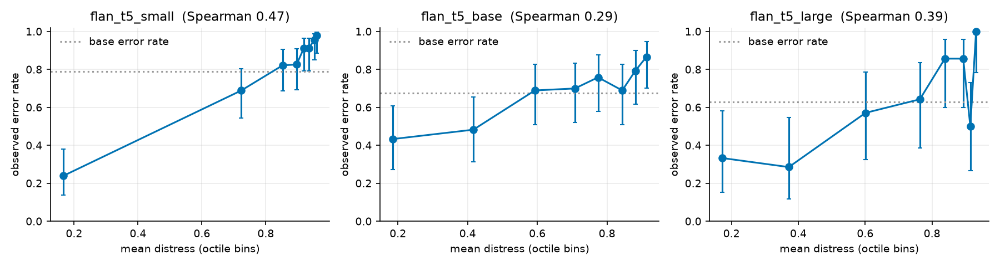

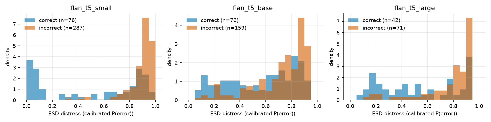

### 9.2 Baseline and ablation comparison (pooled; test AUROC with 95% CI; `Δ` vs chance via permutation test in `vs_chance.csv`)

| method [learner] | flan_t5_small | flan_t5_base | flan_t5_large |
|---|---|---|---|
| B1_base_llm_accept_all [baseline] | 0.50 [0.50, 0.50] | 0.50 [0.50, 0.50] | 0.50 [0.50, 0.50] |
| random_scores [control] | 0.57 [0.49, 0.64] | 0.51 [0.43, 0.60] | 0.45 [0.33, 0.55] |
| B2_token_logprob_confidence [baseline] | 0.56 [0.49, 0.64] | 0.62 [0.53, 0.70] | 0.41 [0.30, 0.52] |
| B3_token_entropy [baseline] | 0.63 [0.56, 0.71] | 0.61 [0.53, 0.70] | 0.38 [0.27, 0.49] |
| B4_self_consistency_disagreement [baseline] | 0.56 [0.50, 0.63] | 0.66 [0.58, 0.74] | 0.75 [0.66, 0.84] |
| B5_llm_judge_self [baseline] | 0.56 [0.49, 0.64] | 0.57 [0.48, 0.65] | 0.56 [0.43, 0.68] |
| B5b_llm_judge_independent(flan_t5_large) [baseline] | 0.47 [0.40, 0.54] | 0.48 [0.40, 0.56] | 0.56 [0.43, 0.68] |
| B6_semantic_disagreement [baseline] | 0.58 [0.51, 0.65] | 0.49 [0.41, 0.57] | 0.50 [0.39, 0.61] |
| lexicon_word_emotion(VADER_negativity) [baseline] | 0.46 [0.42, 0.50] | 0.53 [0.49, 0.56] | 0.53 [0.48, 0.57] |
| lexicon_hedge_density [baseline] | 0.50 [0.50, 0.50] | 0.50 [0.48, 0.51] | 0.48 [0.44, 0.51] |
| A_lexicon_baseline [logreg] | 0.59 [0.53, 0.65] | 0.55 [0.49, 0.61] | 0.53 [0.44, 0.63] |
| A_affective [logreg] | 0.72 [0.65, 0.78] | 0.58 [0.50, 0.66] | 0.59 [0.48, 0.69] |
| B_epistemic [logreg] | 0.56 [0.52, 0.62] | 0.59 [0.53, 0.66] | 0.62 [0.51, 0.72] |
| C_semantic [logreg] | 0.69 [0.61, 0.76] | 0.59 [0.51, 0.66] | 0.62 [0.51, 0.73] |
| D_token [logreg] | 0.71 [0.64, 0.78] | 0.64 [0.56, 0.71] | 0.67 [0.57, 0.77] |
| E_candidate [logreg] | 0.71 [0.63, 0.78] | 0.65 [0.57, 0.73] | 0.73 [0.62, 0.82] |
| L_linguistic [logreg] | 0.70 [0.64, 0.75] | 0.61 [0.53, 0.68] | 0.66 [0.55, 0.77] |
| F_affect+epistemic [logreg] | 0.73 [0.67, 0.79] | 0.64 [0.57, 0.72] | 0.62 [0.50, 0.72] |
| G_affect+semantic [logreg] | 0.78 [0.71, 0.84] | 0.64 [0.57, 0.71] | 0.64 [0.53, 0.74] |
| H_epistemic+semantic [logreg] | 0.70 [0.63, 0.76] | 0.59 [0.51, 0.68] | 0.62 [0.52, 0.72] |
| ESD_text_only(A+B+C) [logreg] | 0.79 [0.73, 0.85] | 0.64 [0.57, 0.72] | 0.64 [0.53, 0.74] |
| ESD_core(A+B+C+D+E) [logreg] | 0.83 [0.77, 0.88] | 0.68 [0.60, 0.75] | 0.73 [0.62, 0.82] |
| ESD_core(A+B+C+D+E) [fixed_equal_weights] | 0.63 [0.55, 0.70] | 0.58 [0.50, 0.66] | 0.64 [0.54, 0.75] |
| ESD_core(A+B+C+D+E) [random_forest] | 0.86 [0.81, 0.90] | 0.78 [0.72, 0.84] | 0.78 [0.68, 0.87] |
| ESD_core(A+B+C+D+E) [grad_boosting] | 0.86 [0.81, 0.91] | 0.75 [0.69, 0.82] | 0.74 [0.64, 0.83] |
| ESD_core(A+B+C+D+E) [mlp] | 0.83 [0.77, 0.89] | 0.73 [0.66, 0.80] | 0.75 [0.65, 0.84] |
| I_all(+linguistic) [logreg] | 0.84 [0.78, 0.89] | 0.70 [0.63, 0.77] | 0.73 [0.63, 0.82] |
| CTRL_task_prior_only [control] | 0.79 [0.74, 0.84] | 0.67 [0.60, 0.74] | 0.73 [0.64, 0.81] |
| CTRL_length+difficulty+task [logreg] | 0.66 [0.60, 0.73] | 0.67 [0.60, 0.74] | 0.68 [0.57, 0.78] |
| ESD_core+CTRL [logreg] | 0.84 [0.78, 0.89] | 0.73 [0.66, 0.80] | 0.74 [0.64, 0.83] |

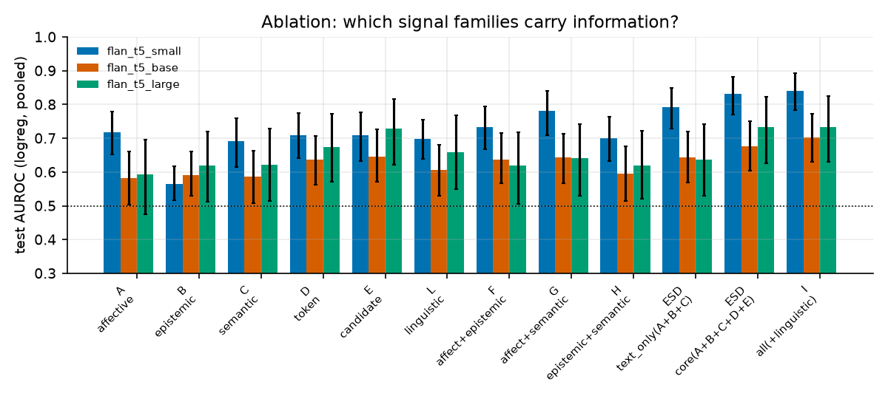

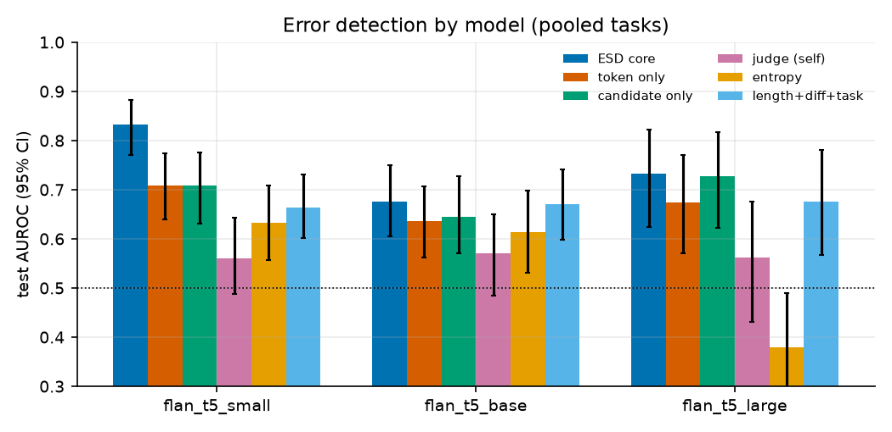

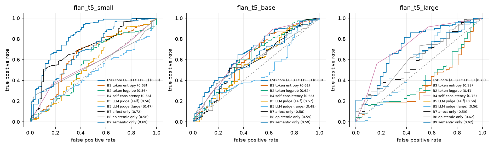

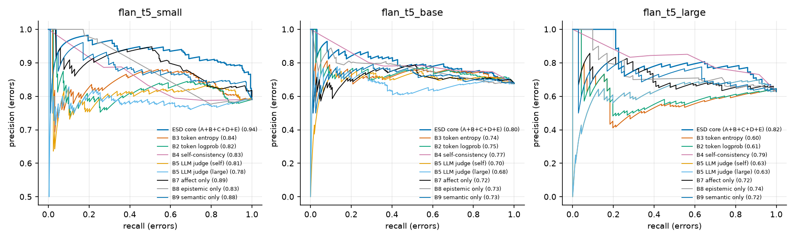

### 9.2b Within-task (macro) AUROC - the confound-free comparison

**Why this exists.** A scorer that knows only the task and predicts its base error rate reaches the pooled AUROC shown above (`CTRL_task_prior_only`), so pooled AUROC largely measures task identity, and unnormalised baselines (e.g. token entropy) can even fall below 0.5 pooled because token statistics differ by task. Within-task AUROC (test-size-weighted mean over tasks; stratified bootstrap) removes this. **This metric was adopted after seeing the task-prior result - it is a post-hoc decision, disclosed here; pooled results are still reported.**

| method | flan_t5_base | flan_t5_large | flan_t5_small |
|---|---|---|---|
| ESD_core(A+B+C+D+E) | 0.58 [0.50, 0.66] | 0.72 [0.57, 0.80] | 0.69 [0.63, 0.77] |
| A_affective | 0.55 [0.46, 0.63] | 0.60 [0.47, 0.67] | 0.59 [0.50, 0.68] |
| B_epistemic | 0.54 [0.47, 0.60] | 0.60 [0.46, 0.68] | 0.52 [0.46, 0.57] |
| C_semantic | 0.54 [0.45, 0.62] | 0.66 [0.51, 0.76] | 0.60 [0.51, 0.67] |
| D_token | 0.60 [0.53, 0.67] | 0.69 [0.56, 0.77] | 0.61 [0.53, 0.70] |
| E_candidate | 0.57 [0.48, 0.64] | 0.73 [0.60, 0.81] | 0.59 [0.51, 0.68] |
| L_linguistic | 0.56 [0.49, 0.63] | 0.69 [0.56, 0.77] | 0.59 [0.52, 0.66] |
| ESD_text_only(A+B+C) | 0.52 [0.43, 0.60] | 0.61 [0.45, 0.71] | 0.63 [0.53, 0.71] |
| CTRL_length+difficulty+task | 0.73 [0.65, 0.80] | 0.71 [0.59, 0.79] | 0.67 [0.59, 0.75] |
| ESD_core+CTRL | 0.67 [0.58, 0.75] | 0.71 [0.57, 0.81] | 0.72 [0.63, 0.79] |
| B2_token_logprob_confidence | 0.60 [0.49, 0.69] | 0.50 [0.36, 0.59] | 0.47 [0.40, 0.55] |
| B3_token_entropy | 0.57 [0.48, 0.67] | 0.50 [0.35, 0.59] | 0.49 [0.41, 0.57] |
| B4_self_consistency_disagreement | 0.56 [0.50, 0.64] | 0.79 [0.70, 0.85] | 0.50 [0.44, 0.56] |
| B5_llm_judge_self | 0.61 [0.52, 0.69] | 0.62 [0.49, 0.73] | 0.64 [0.56, 0.72] |
| B5b_llm_judge_independent(flan_t5_large) | 0.63 [0.55, 0.72] | 0.62 [0.51, 0.73] | 0.64 [0.57, 0.72] |
| B6_semantic_disagreement | 0.54 [0.45, 0.62] | 0.59 [0.50, 0.71] | 0.53 [0.45, 0.61] |
| random_scores | 0.53 [0.42, 0.61] | 0.44 [0.34, 0.59] | 0.58 [0.48, 0.67] |


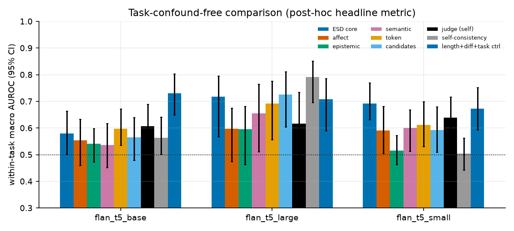

### 9.3 Per-task AUROC of ESD core (logreg) and the strongest simple baselines

| model | scope | B3_token_entropy | B4_self_consistency_di | B5_llm_judge_self | ESD_core(A+B+C+D+E) |
|---|---|---|---|---|---|
| flan_t5_base | code | 0.78 [0.60, 0.93] | 0.38 [0.17, 0.61] | 0.63 [0.40, 0.86] | 0.99 [0.96, 1.00] |
| flan_t5_base | factual_qa | 0.56 [0.39, 0.73] | 0.57 [0.41, 0.74] | 0.56 [0.37, 0.75] | 0.65 [0.48, 0.81] |
| flan_t5_base | instruction | 0.46 [0.24, 0.68] | 0.42 [0.31, 0.56] | 0.52 [0.28, 0.78] | 0.57 [0.36, 0.76] |
| flan_t5_base | logic | 0.53 [0.35, 0.72] | 0.71 [0.55, 0.86] | 0.85 [0.70, 0.96] | 0.99 [0.97, 1.00] |
| flan_t5_base | longform | 0.62 [0.42, 0.81] | 0.73 [0.56, 0.89] | 0.49 [0.30, 0.70] | 0.60 [0.40, 0.79] |
| flan_t5_base | math | 0.49 [0.20, 0.76] | 0.57 [0.31, 0.83] | 0.61 [0.36, 0.82] | 0.67 [0.38, 0.88] |
| flan_t5_large | code | 1.00 [1.00, 1.00] | 0.96 [0.88, 1.00] | 1.00 [1.00, 1.00] | 1.00 [1.00, 1.00] |
| flan_t5_large | factual_qa | 0.24 [0.06, 0.48] | 0.84 [0.68, 0.97] | 0.53 [0.29, 0.77] | 0.69 [0.46, 0.90] |
| flan_t5_large | instruction | 0.52 [0.21, 0.81] | 0.56 [0.39, 0.80] | 0.35 [0.00, 0.71] | 0.30 [0.00, 0.67] |
| flan_t5_large | logic | 0.32 [0.12, 0.57] | 0.62 [0.35, 0.83] | 0.65 [0.35, 0.92] | 0.90 [0.69, 1.00] |
| flan_t5_large | longform | 0.25 [0.04, 0.52] | 0.82 [0.56, 0.99] | 0.57 [0.25, 0.91] | 0.89 [0.68, 1.00] |
| flan_t5_large | math | 0.81 [0.60, 1.00] | 0.97 [0.90, 1.00] | 0.62 [0.40, 0.85] | 0.94 [0.80, 1.00] |
| flan_t5_small | factual_qa | 0.51 [0.35, 0.67] | 0.46 [0.34, 0.58] | 0.54 [0.38, 0.69] | 0.53 [0.38, 0.68] |
| flan_t5_small | instruction | 0.43 [0.28, 0.60] | 0.56 [0.47, 0.68] | 0.66 [0.46, 0.85] | 0.58 [0.37, 0.79] |
| flan_t5_small | logic | 0.55 [0.40, 0.70] | 0.52 [0.38, 0.64] | 0.81 [0.69, 0.91] | 1.00 [0.99, 1.00] |
| flan_t5_small | longform | 0.45 [0.28, 0.64] | 0.49 [0.31, 0.69] | 0.58 [0.39, 0.76] | 0.69 [0.55, 0.81] |

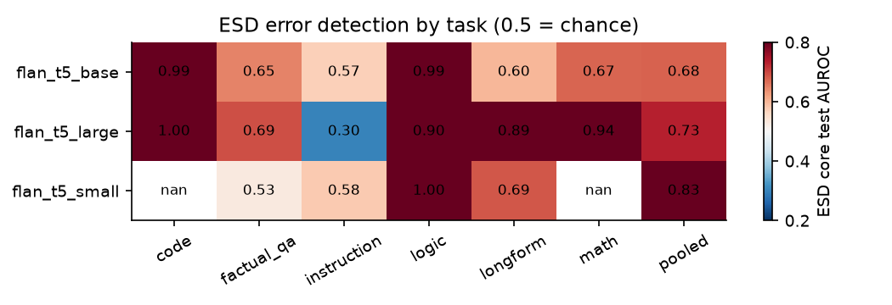

### 9.4 Calibration and decision metrics at the validation-chosen threshold (pooled; ESD core logreg)

| model | method | precision | recall | F1 | false_acceptance | false_rejection | accepted_error_rate | coverage | AURC | Brier | ECE |
|---|---|---|---|---|---|---|---|---|---|---|---|
| flan_t5_small | ESD_core(A+B+C+D+E) | 0.858 | 0.993 | 0.921 | 0.007 | 0.618 | 0.065 | 0.085 | 0.566 | 0.105 | 0.042 |
| flan_t5_small | B3_token_entropy | 0.792 | 0.969 | 0.871 | 0.031 | 0.961 | 0.750 | 0.033 | 0.727 | 0.165 | 0.092 |
| flan_t5_small | B5_llm_judge_self | 0.794 | 0.941 | 0.861 | 0.059 | 0.921 | 0.739 | 0.063 | 0.740 | 0.168 | 0.027 |
| flan_t5_small | B4_self_consistency_disagreeme | 0.791 | 1.000 | 0.883 | 0.000 | 1.000 | n/a | 0.000 | 0.806 | 0.165 | 0.032 |
| flan_t5_base | ESD_core(A+B+C+D+E) | 0.742 | 0.830 | 0.783 | 0.170 | 0.605 | 0.474 | 0.243 | 0.544 | 0.211 | 0.119 |
| flan_t5_base | B3_token_entropy | 0.716 | 0.918 | 0.804 | 0.082 | 0.763 | 0.419 | 0.132 | 0.576 | 0.217 | 0.030 |
| flan_t5_base | B5_llm_judge_self | 0.686 | 0.975 | 0.805 | 0.025 | 0.934 | 0.444 | 0.038 | 0.607 | 0.216 | 0.010 |
| flan_t5_base | B4_self_consistency_disagreeme | 0.747 | 0.893 | 0.814 | 0.107 | 0.632 | 0.378 | 0.191 | 0.536 | 0.207 | 0.081 |
| flan_t5_large | ESD_core(A+B+C+D+E) | 0.711 | 0.901 | 0.795 | 0.099 | 0.619 | 0.304 | 0.204 | 0.442 | 0.199 | 0.102 |
| flan_t5_large | B3_token_entropy | 0.645 | 1.000 | 0.785 | 0.000 | 0.929 | 0.000 | 0.027 | 0.679 | 0.243 | 0.106 |
| flan_t5_large | B5_llm_judge_self | 0.689 | 0.873 | 0.770 | 0.127 | 0.667 | 0.391 | 0.204 | 0.544 | 0.242 | 0.176 |
| flan_t5_large | B4_self_consistency_disagreeme | 0.730 | 0.915 | 0.812 | 0.085 | 0.571 | 0.250 | 0.212 | 0.431 | 0.192 | 0.088 |

**False acceptance** = P(harness passes | answer wrong). **False rejection** = P(harness rejects | answer right). Threshold = F1-maximiser on VALIDATION. A flag-everything or flag-nothing rule can look good on one of these alone, so read them with coverage and AURC.

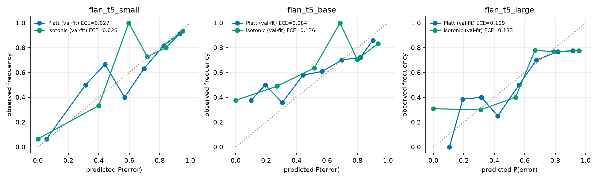

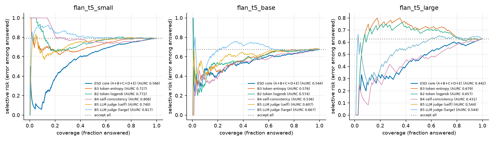

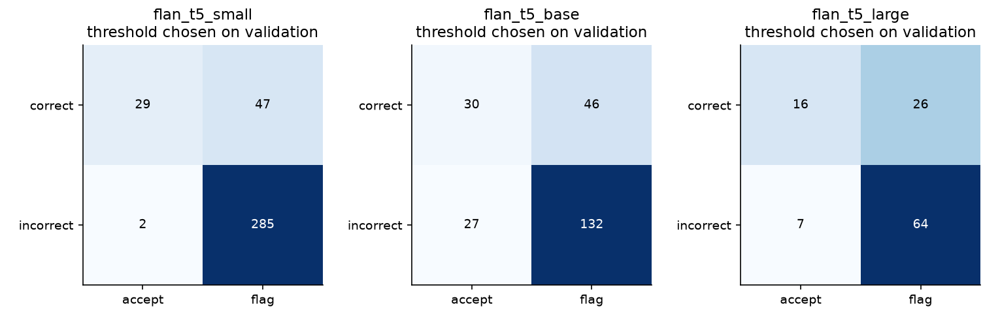

### 9.5 Verification and repair

Verifier (independent Flan-T5-large judge, threshold chosen on validation, + deterministic tools) applied to every answer:

| model | tau_judge | n | verifier_false_accept(P(pass|wrong)) | verifier_false_reject(P(fail|correct)) | initial_error_rate |
|---|---|---|---|---|---|
| flan_t5_small | 0.425 | 363 | 0.108 | 0.605 | 0.791 |
| flan_t5_base | 0.950 | 235 | 0.006 | 0.711 | 0.677 |
| flan_t5_large | 0.875 | 113 | 0.127 | 0.500 | 0.628 |

| model | policy | budget | coverage | accepted_error_rate | error_leakage | repair_success_rate | harm_rate | correct_answers_lost | verifications_per_item | regenerations_per_item |
|---|---|---|---|---|---|---|---|---|---|---|
| flan_t5_small | ESD_core | 0.000 | 1.000 | 0.791 | 0.791 | n/a | n/a | 0.000 | 0.000 | 0.000 |
| flan_t5_small | ESD_core | 0.200 | 0.835 | 0.756 | 0.631 | 0.014 | 1.000 | 0.008 | 0.559 | 0.358 |
| flan_t5_small | ESD_core | 0.400 | 0.691 | 0.709 | 0.490 | 0.022 | 0.750 | 0.017 | 1.069 | 0.669 |
| flan_t5_small | ESD_core | 0.600 | 0.543 | 0.629 | 0.342 | 0.025 | 0.421 | 0.022 | 1.592 | 0.992 |
| flan_t5_small | ESD_core | 1.000 | 0.242 | 0.523 | 0.127 | 0.028 | 0.553 | 0.116 | 2.625 | 1.625 |
| flan_t5_small | B3_entropy | 0.000 | 1.000 | 0.791 | 0.791 | n/a | n/a | 0.000 | 0.000 | 0.000 |
| flan_t5_small | B3_entropy | 0.200 | 0.835 | 0.746 | 0.623 | 0.016 | 0.000 | 0.000 | 0.534 | 0.333 |
| flan_t5_small | B3_entropy | 0.400 | 0.683 | 0.706 | 0.482 | 0.016 | 0.263 | 0.014 | 1.058 | 0.658 |
| flan_t5_small | B3_entropy | 0.600 | 0.545 | 0.662 | 0.361 | 0.016 | 0.429 | 0.033 | 1.573 | 0.972 |
| flan_t5_small | B3_entropy | 1.000 | 0.242 | 0.523 | 0.127 | 0.028 | 0.553 | 0.116 | 2.625 | 1.625 |
| flan_t5_small | B4_self_consistency | 0.000 | 1.000 | 0.791 | 0.791 | n/a | n/a | 0.000 | 0.000 | 0.000 |
| flan_t5_small | B4_self_consistency | 0.200 | 0.818 | 0.741 | 0.606 | 0.013 | 0.000 | 0.000 | 0.620 | 0.377 |
| flan_t5_small | B4_self_consistency | 0.400 | 0.667 | 0.723 | 0.482 | 0.029 | 0.464 | 0.036 | 1.168 | 0.705 |
| flan_t5_small | B4_self_consistency | 0.600 | 0.562 | 0.711 | 0.399 | 0.034 | 0.500 | 0.063 | 1.554 | 0.937 |
| flan_t5_small | B4_self_consistency | 1.000 | 0.242 | 0.523 | 0.127 | 0.028 | 0.553 | 0.116 | 2.625 | 1.625 |
| flan_t5_small | B5_judge_independent | 0.000 | 1.000 | 0.791 | 0.791 | n/a | n/a | 0.000 | 0.000 | 0.000 |
| flan_t5_small | B5_judge_independent | 0.200 | 0.813 | 0.783 | 0.636 | 0.034 | 1.000 | 0.039 | 0.595 | 0.394 |
| flan_t5_small | B5_judge_independent | 0.400 | 0.636 | 0.779 | 0.496 | 0.026 | 0.903 | 0.077 | 1.171 | 0.771 |
| flan_t5_small | B5_judge_independent | 0.600 | 0.466 | 0.757 | 0.353 | 0.041 | 0.875 | 0.116 | 1.749 | 1.149 |
| flan_t5_small | B5_judge_independent | 1.000 | 0.242 | 0.523 | 0.127 | 0.028 | 0.553 | 0.116 | 2.625 | 1.625 |
| flan_t5_small | random | 0.000 | 1.000 | 0.791 | 0.791 | n/a | n/a | 0.000 | 0.000 | 0.000 |
| flan_t5_small | random | 0.200 | 0.837 | 0.770 | 0.645 | 0.016 | 0.700 | 0.019 | 0.540 | 0.339 |
| flan_t5_small | random | 0.400 | 0.691 | 0.753 | 0.521 | 0.025 | 0.739 | 0.047 | 1.055 | 0.656 |
| flan_t5_small | random | 0.600 | 0.529 | 0.698 | 0.369 | 0.022 | 0.629 | 0.061 | 1.598 | 0.997 |
| flan_t5_small | random | 1.000 | 0.242 | 0.523 | 0.127 | 0.028 | 0.553 | 0.116 | 2.625 | 1.625 |
| flan_t5_small | oracle_routing(upper bound) | 0.000 | 1.000 | 0.791 | 0.791 | n/a | n/a | 0.000 | 0.000 | 0.000 |
| flan_t5_small | oracle_routing(upper bound) | 0.200 | 0.832 | 0.745 | 0.620 | 0.014 | n/a | 0.000 | 0.556 | 0.355 |
| flan_t5_small | oracle_routing(upper bound) | 0.400 | 0.672 | 0.672 | 0.452 | 0.028 | n/a | 0.000 | 1.096 | 0.697 |
| flan_t5_small | oracle_routing(upper bound) | 0.600 | 0.512 | 0.559 | 0.287 | 0.028 | n/a | 0.000 | 1.650 | 1.050 |
| flan_t5_small | oracle_routing(upper bound) | 1.000 | 0.242 | 0.523 | 0.127 | 0.028 | 0.553 | 0.116 | 2.625 | 1.625 |
| flan_t5_base | ESD_core | 0.000 | 1.000 | 0.677 | 0.677 | n/a | n/a | 0.000 | 0.000 | 0.000 |
| flan_t5_base | ESD_core | 0.200 | 0.804 | 0.630 | 0.506 | 0.000 | 0.857 | 0.026 | 0.591 | 0.391 |
| flan_t5_base | ESD_core | 0.400 | 0.634 | 0.584 | 0.370 | 0.000 | 0.667 | 0.060 | 1.136 | 0.736 |
| flan_t5_base | ESD_core | 0.600 | 0.468 | 0.491 | 0.230 | 0.000 | 0.606 | 0.085 | 1.677 | 1.077 |
| flan_t5_base | ESD_core | 1.000 | 0.115 | 0.111 | 0.013 | 0.006 | 0.697 | 0.226 | 2.796 | 1.796 |
| flan_t5_base | B3_entropy | 0.000 | 1.000 | 0.677 | 0.677 | n/a | n/a | 0.000 | 0.000 | 0.000 |
| flan_t5_base | B3_entropy | 0.200 | 0.855 | 0.642 | 0.549 | 0.030 | 0.357 | 0.021 | 0.506 | 0.306 |
| flan_t5_base | B3_entropy | 0.400 | 0.660 | 0.600 | 0.396 | 0.014 | 0.600 | 0.064 | 1.098 | 0.698 |
| flan_t5_base | B3_entropy | 0.600 | 0.460 | 0.509 | 0.234 | 0.009 | 0.706 | 0.102 | 1.698 | 1.098 |
| flan_t5_base | B3_entropy | 1.000 | 0.115 | 0.111 | 0.013 | 0.006 | 0.697 | 0.226 | 2.796 | 1.796 |
| flan_t5_base | B4_self_consistency | 0.000 | 1.000 | 0.677 | 0.677 | n/a | n/a | 0.000 | 0.000 | 0.000 |
| flan_t5_base | B4_self_consistency | 0.200 | 0.800 | 0.606 | 0.485 | 0.000 | 0.182 | 0.009 | 0.638 | 0.400 |
| flan_t5_base | B4_self_consistency | 0.400 | 0.600 | 0.525 | 0.315 | 0.011 | 0.417 | 0.043 | 1.281 | 0.809 |
| flan_t5_base | B4_self_consistency | 0.600 | 0.447 | 0.457 | 0.204 | 0.009 | 0.541 | 0.085 | 1.753 | 1.115 |
| flan_t5_base | B4_self_consistency | 1.000 | 0.115 | 0.111 | 0.013 | 0.006 | 0.697 | 0.226 | 2.796 | 1.796 |
| flan_t5_base | B5_judge_independent | 0.000 | 1.000 | 0.677 | 0.677 | n/a | n/a | 0.000 | 0.000 | 0.000 |
| flan_t5_base | B5_judge_independent | 0.200 | 0.809 | 0.663 | 0.536 | 0.000 | 0.857 | 0.051 | 0.583 | 0.383 |
| flan_t5_base | B5_judge_independent | 0.400 | 0.613 | 0.694 | 0.426 | 0.000 | 0.941 | 0.136 | 1.179 | 0.779 |
| flan_t5_base | B5_judge_independent | 0.600 | 0.426 | 0.680 | 0.289 | 0.000 | 0.898 | 0.187 | 1.753 | 1.153 |
| flan_t5_base | B5_judge_independent | 1.000 | 0.115 | 0.111 | 0.013 | 0.006 | 0.697 | 0.226 | 2.796 | 1.796 |
| flan_t5_base | random | 0.000 | 1.000 | 0.677 | 0.677 | n/a | n/a | 0.000 | 0.000 | 0.000 |
| flan_t5_base | random | 0.200 | 0.830 | 0.656 | 0.545 | 0.000 | 0.643 | 0.038 | 0.553 | 0.353 |
| flan_t5_base | random | 0.400 | 0.647 | 0.632 | 0.409 | 0.000 | 0.690 | 0.085 | 1.119 | 0.719 |
| flan_t5_base | random | 0.600 | 0.464 | 0.596 | 0.277 | 0.000 | 0.727 | 0.136 | 1.694 | 1.094 |
| flan_t5_base | random | 1.000 | 0.115 | 0.111 | 0.013 | 0.006 | 0.697 | 0.226 | 2.796 | 1.796 |
| flan_t5_base | oracle_routing(upper bound) | 0.000 | 1.000 | 0.677 | 0.677 | n/a | n/a | 0.000 | 0.000 | 0.000 |
| flan_t5_base | oracle_routing(upper bound) | 0.200 | 0.804 | 0.598 | 0.481 | 0.000 | n/a | 0.000 | 0.591 | 0.391 |
| flan_t5_base | oracle_routing(upper bound) | 0.400 | 0.604 | 0.465 | 0.281 | 0.000 | n/a | 0.000 | 1.191 | 0.791 |
| flan_t5_base | oracle_routing(upper bound) | 0.600 | 0.413 | 0.206 | 0.085 | 0.007 | n/a | 0.000 | 1.787 | 1.187 |
| flan_t5_base | oracle_routing(upper bound) | 1.000 | 0.115 | 0.111 | 0.013 | 0.006 | 0.697 | 0.226 | 2.796 | 1.796 |
| flan_t5_large | ESD_core | 0.000 | 1.000 | 0.628 | 0.628 | n/a | n/a | 0.000 | 0.000 | 0.000 |
| flan_t5_large | ESD_core | 0.200 | 0.832 | 0.585 | 0.487 | 0.000 | 0.600 | 0.027 | 0.575 | 0.372 |
| flan_t5_large | ESD_core | 0.400 | 0.690 | 0.500 | 0.345 | 0.057 | 0.500 | 0.044 | 1.088 | 0.690 |
| flan_t5_large | ESD_core | 0.600 | 0.531 | 0.383 | 0.204 | 0.057 | 0.533 | 0.071 | 1.619 | 1.018 |
| flan_t5_large | ESD_core | 1.000 | 0.336 | 0.316 | 0.106 | 0.042 | 0.452 | 0.168 | 2.442 | 1.442 |
| flan_t5_large | B3_entropy | 0.000 | 1.000 | 0.628 | 0.628 | n/a | n/a | 0.000 | 0.000 | 0.000 |
| flan_t5_large | B3_entropy | 0.200 | 0.876 | 0.606 | 0.531 | 0.000 | 0.300 | 0.027 | 0.469 | 0.265 |
| flan_t5_large | B3_entropy | 0.400 | 0.761 | 0.628 | 0.478 | 0.000 | 0.435 | 0.088 | 0.929 | 0.531 |
| flan_t5_large | B3_entropy | 0.600 | 0.637 | 0.583 | 0.372 | 0.081 | 0.484 | 0.133 | 1.407 | 0.805 |
| flan_t5_large | B3_entropy | 1.000 | 0.336 | 0.316 | 0.106 | 0.042 | 0.452 | 0.168 | 2.442 | 1.442 |
| flan_t5_large | B4_self_consistency | 0.000 | 1.000 | 0.628 | 0.628 | n/a | n/a | 0.000 | 0.000 | 0.000 |
| flan_t5_large | B4_self_consistency | 0.200 | 0.823 | 0.548 | 0.451 | 0.000 | 0.000 | 0.000 | 0.566 | 0.354 |
| flan_t5_large | B4_self_consistency | 0.400 | 0.717 | 0.481 | 0.345 | 0.050 | 0.286 | 0.018 | 1.035 | 0.619 |
| flan_t5_large | B4_self_consistency | 0.600 | 0.478 | 0.333 | 0.159 | 0.046 | 0.375 | 0.080 | 1.947 | 1.159 |
| flan_t5_large | B4_self_consistency | 1.000 | 0.336 | 0.316 | 0.106 | 0.042 | 0.452 | 0.168 | 2.442 | 1.442 |
| flan_t5_large | B5_judge_independent | 0.000 | 1.000 | 0.628 | 0.628 | n/a | n/a | 0.000 | 0.000 | 0.000 |
| flan_t5_large | B5_judge_independent | 0.200 | 0.823 | 0.613 | 0.504 | 0.071 | 0.778 | 0.062 | 0.566 | 0.363 |
| flan_t5_large | B5_judge_independent | 0.400 | 0.664 | 0.587 | 0.389 | 0.107 | 0.824 | 0.124 | 1.133 | 0.735 |
| flan_t5_large | B5_judge_independent | 0.600 | 0.487 | 0.491 | 0.239 | 0.064 | 0.810 | 0.150 | 1.726 | 1.124 |
| flan_t5_large | B5_judge_independent | 1.000 | 0.336 | 0.316 | 0.106 | 0.042 | 0.452 | 0.168 | 2.442 | 1.442 |
| flan_t5_large | random | 0.000 | 1.000 | 0.628 | 0.628 | n/a | n/a | 0.000 | 0.000 | 0.000 |
| flan_t5_large | random | 0.200 | 0.841 | 0.621 | 0.522 | 0.000 | 0.600 | 0.053 | 0.522 | 0.319 |
| flan_t5_large | random | 0.400 | 0.699 | 0.595 | 0.416 | 0.000 | 0.588 | 0.088 | 1.053 | 0.655 |
| flan_t5_large | random | 0.600 | 0.584 | 0.561 | 0.327 | 0.000 | 0.464 | 0.115 | 1.504 | 0.903 |
| flan_t5_large | random | 1.000 | 0.336 | 0.316 | 0.106 | 0.042 | 0.452 | 0.168 | 2.442 | 1.442 |
| flan_t5_large | oracle_routing(upper bound) | 0.000 | 1.000 | 0.628 | 0.628 | n/a | n/a | 0.000 | 0.000 | 0.000 |
| flan_t5_large | oracle_routing(upper bound) | 0.200 | 0.832 | 0.532 | 0.442 | 0.087 | n/a | 0.000 | 0.558 | 0.354 |
| flan_t5_large | oracle_routing(upper bound) | 0.400 | 0.673 | 0.421 | 0.283 | 0.044 | n/a | 0.000 | 1.088 | 0.690 |
| flan_t5_large | oracle_routing(upper bound) | 0.600 | 0.504 | 0.211 | 0.106 | 0.044 | n/a | 0.000 | 1.637 | 1.035 |
| flan_t5_large | oracle_routing(upper bound) | 1.000 | 0.336 | 0.316 | 0.106 | 0.042 | 0.452 | 0.168 | 2.442 | 1.442 |

Majority-vote answer selection (self-consistency, no verifier): error rate vs greedy:

| model | initial_error_rate | accepted_error_rate |
|---|---|---|
| flan_t5_small | 0.791 | 0.799 |
| flan_t5_base | 0.677 | 0.681 |
| flan_t5_large | 0.628 | 0.602 |

Paired exact McNemar tests (ESD routing vs comparator routing, 40% budget, outcome = 'wrong answer reached user'; Holm-adjusted):

| model | budget | esd_leaks_only | other_leaks_only | comparator | esd_leakage | comparator_leakage | p_mcnemar | p_holm |
|---|---|---|---|---|---|---|---|---|
| flan_t5_small | 0.400 | 18 | 17 | ESD_text(A+B+C) | 0.490 | 0.488 | 1.000 | 1.000 |
| flan_t5_small | 0.400 | 49 | 43 | D_token(logreg) | 0.490 | 0.474 | 0.602 | 1.000 |
| flan_t5_small | 0.400 | 44 | 41 | B3_entropy | 0.490 | 0.482 | 0.828 | 1.000 |
| flan_t5_small | 0.400 | 66 | 63 | B4_self_consistency | 0.490 | 0.482 | 0.860 | 1.000 |
| flan_t5_small | 0.400 | 75 | 77 | B5_judge_independent | 0.490 | 0.496 | 0.935 | 1.000 |
| flan_t5_small | 0.400 | 52 | 63 | random | 0.490 | 0.521 | 0.351 | 1.000 |
| flan_t5_small | 0.400 | 72 | 58 | oracle_routing(upper bound) | 0.490 | 0.452 | 0.254 | 1.000 |
| flan_t5_base | 0.400 | 14 | 15 | ESD_text(A+B+C) | 0.370 | 0.374 | 1.000 | 1.000 |
| flan_t5_base | 0.400 | 32 | 29 | D_token(logreg) | 0.370 | 0.357 | 0.798 | 1.000 |
| flan_t5_base | 0.400 | 40 | 46 | B3_entropy | 0.370 | 0.396 | 0.590 | 1.000 |
| flan_t5_base | 0.400 | 37 | 24 | B4_self_consistency | 0.370 | 0.315 | 0.124 | 1.000 |
| flan_t5_base | 0.400 | 40 | 53 | B5_judge_independent | 0.370 | 0.426 | 0.213 | 1.000 |
| flan_t5_base | 0.400 | 32 | 41 | random | 0.370 | 0.409 | 0.349 | 1.000 |
| flan_t5_base | 0.400 | 50 | 29 | oracle_routing(upper bound) | 0.370 | 0.281 | 0.024 | 0.498 |
| flan_t5_large | 0.400 | 10 | 11 | ESD_text(A+B+C) | 0.345 | 0.354 | 1.000 | 1.000 |
| flan_t5_large | 0.400 | 6 | 6 | D_token(logreg) | 0.345 | 0.345 | 1.000 | 1.000 |
| flan_t5_large | 0.400 | 12 | 27 | B3_entropy | 0.345 | 0.478 | 0.024 | 0.498 |
| flan_t5_large | 0.400 | 16 | 16 | B4_self_consistency | 0.345 | 0.345 | 1.000 | 1.000 |
| flan_t5_large | 0.400 | 14 | 19 | B5_judge_independent | 0.345 | 0.389 | 0.487 | 1.000 |
| flan_t5_large | 0.400 | 9 | 17 | random | 0.345 | 0.416 | 0.169 | 1.000 |
| flan_t5_large | 0.400 | 22 | 15 | oracle_routing(upper bound) | 0.345 | 0.283 | 0.324 | 1.000 |

Regeneration reuses stored i.i.d. temperature samples (`routing/simulate.py`). Ground truth is used only to score outcomes. **Retrieval-based verification: Not evaluated.** The instruction-following tool is the grader's own checker (an upper-bound tool); code tool sees only 2 visible tests.

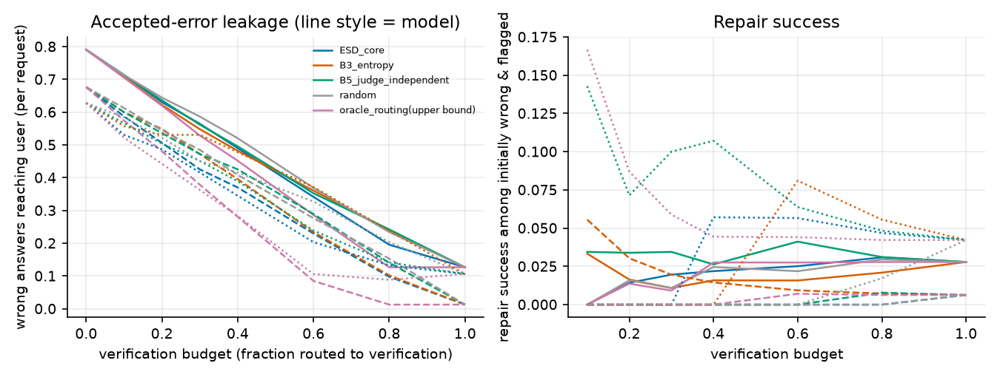

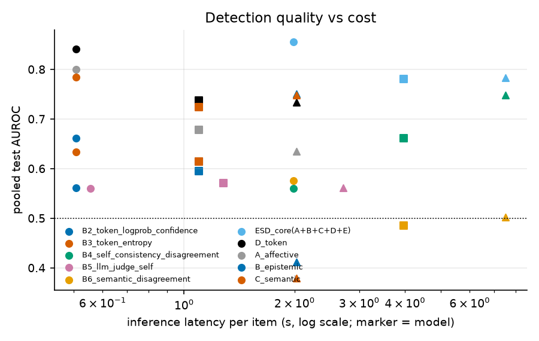

## 10. Ablation study (A..I)

| method | flan_t5_base | flan_t5_large | flan_t5_small |
|---|---|---|---|
| A_affective | 0.58 [0.50, 0.66] | 0.59 [0.48, 0.69] | 0.72 [0.65, 0.78] |
| B_epistemic | 0.59 [0.53, 0.66] | 0.62 [0.51, 0.72] | 0.56 [0.52, 0.62] |
| C_semantic | 0.59 [0.51, 0.66] | 0.62 [0.51, 0.73] | 0.69 [0.61, 0.76] |
| D_token | 0.64 [0.56, 0.71] | 0.67 [0.57, 0.77] | 0.71 [0.64, 0.78] |
| ESD_core(A+B+C+D+E) | 0.68 [0.60, 0.75] | 0.73 [0.62, 0.82] | 0.83 [0.77, 0.88] |
| E_candidate | 0.65 [0.57, 0.73] | 0.73 [0.62, 0.82] | 0.71 [0.63, 0.78] |
| F_affect+epistemic | 0.64 [0.57, 0.72] | 0.62 [0.50, 0.72] | 0.73 [0.67, 0.79] |
| G_affect+semantic | 0.64 [0.57, 0.71] | 0.64 [0.53, 0.74] | 0.78 [0.71, 0.84] |
| H_epistemic+semantic | 0.59 [0.51, 0.68] | 0.62 [0.52, 0.72] | 0.70 [0.63, 0.76] |
| I_all(+linguistic) | 0.70 [0.63, 0.77] | 0.73 [0.63, 0.82] | 0.84 [0.78, 0.89] |

Paired comparisons of ESD core against each component (same learner; paired bootstrap ΔAUROC; paired permutation p; Holm-adjusted over all comparisons):

| model | comparator | auroc_ref | auroc_cmp | delta_auroc | delta_lo | delta_hi | p_perm | p_holm |
|---|---|---|---|---|---|---|---|---|
| flan_t5_small | A_affective | 0.833 | 0.717 | 0.115 | 0.052 | 0.170 | 0.001 | 0.170 |
| flan_t5_small | B_epistemic | 0.833 | 0.565 | 0.268 | 0.185 | 0.341 | 0.001 | 0.170 |
| flan_t5_small | C_semantic | 0.833 | 0.691 | 0.141 | 0.079 | 0.209 | 0.001 | 0.170 |
| flan_t5_small | D_token | 0.833 | 0.709 | 0.124 | 0.039 | 0.207 | 0.002 | 0.292 |
| flan_t5_small | E_candidate | 0.833 | 0.709 | 0.123 | 0.055 | 0.187 | 0.001 | 0.170 |
| flan_t5_small | F_affect+epistemic | 0.833 | 0.733 | 0.100 | 0.041 | 0.162 | 0.001 | 0.170 |
| flan_t5_small | G_affect+semantic | 0.833 | 0.781 | 0.052 | 0.018 | 0.086 | 0.006 | 0.851 |
| flan_t5_small | H_epistemic+semantic | 0.833 | 0.700 | 0.133 | 0.071 | 0.192 | 0.001 | 0.170 |
| flan_t5_small | ESD_text_only(A+B+C) | 0.833 | 0.793 | 0.039 | 0.013 | 0.068 | 0.012 | 1.000 |
| flan_t5_base | A_affective | 0.676 | 0.582 | 0.094 | 0.018 | 0.168 | 0.012 | 1.000 |
| flan_t5_base | B_epistemic | 0.676 | 0.590 | 0.086 | 0.010 | 0.168 | 0.062 | 1.000 |
| flan_t5_base | C_semantic | 0.676 | 0.587 | 0.089 | 0.014 | 0.171 | 0.042 | 1.000 |
| flan_t5_base | D_token | 0.676 | 0.637 | 0.039 | -0.037 | 0.114 | 0.354 | 1.000 |
| flan_t5_base | E_candidate | 0.676 | 0.646 | 0.030 | -0.035 | 0.096 | 0.438 | 1.000 |
| flan_t5_base | F_affect+epistemic | 0.676 | 0.637 | 0.040 | -0.028 | 0.098 | 0.187 | 1.000 |
| flan_t5_base | G_affect+semantic | 0.676 | 0.643 | 0.033 | -0.022 | 0.089 | 0.259 | 1.000 |
| flan_t5_base | H_epistemic+semantic | 0.676 | 0.594 | 0.082 | 0.012 | 0.155 | 0.032 | 1.000 |
| flan_t5_base | ESD_text_only(A+B+C) | 0.676 | 0.643 | 0.033 | -0.008 | 0.076 | 0.135 | 1.000 |
| flan_t5_large | A_affective | 0.733 | 0.593 | 0.140 | 0.044 | 0.236 | 0.008 | 1.000 |
| flan_t5_large | B_epistemic | 0.733 | 0.619 | 0.114 | 0.002 | 0.227 | 0.058 | 1.000 |
| flan_t5_large | C_semantic | 0.733 | 0.622 | 0.110 | -0.013 | 0.239 | 0.097 | 1.000 |
| flan_t5_large | D_token | 0.733 | 0.674 | 0.059 | -0.006 | 0.130 | 0.098 | 1.000 |
| flan_t5_large | E_candidate | 0.733 | 0.729 | 0.004 | -0.080 | 0.093 | 0.932 | 1.000 |
| flan_t5_large | F_affect+epistemic | 0.733 | 0.619 | 0.114 | 0.026 | 0.209 | 0.008 | 1.000 |
| flan_t5_large | G_affect+semantic | 0.733 | 0.641 | 0.092 | -0.001 | 0.183 | 0.056 | 1.000 |
| flan_t5_large | H_epistemic+semantic | 0.733 | 0.618 | 0.114 | 0.000 | 0.227 | 0.066 | 1.000 |
| flan_t5_large | ESD_text_only(A+B+C) | 0.733 | 0.636 | 0.097 | 0.012 | 0.189 | 0.028 | 1.000 |

Wilcoxon signed-rank across (model, task) cells (per-task test AUROC, logreg):

| a | b | n_cells | median_delta_auroc | p_wilcoxon |
|---|---|---|---|---|
| ESD_core(A+B+C+D+E) | A_affective | 16 | 0.028 | 0.100 |
| ESD_core(A+B+C+D+E) | B_epistemic | 15 | 0.177 | 0.002 |
| ESD_core(A+B+C+D+E) | C_semantic | 16 | 0.041 | 0.051 |
| ESD_core(A+B+C+D+E) | D_token | 16 | 0.072 | 0.027 |
| ESD_core(A+B+C+D+E) | E_candidate | 16 | 0.013 | 0.198 |
| ESD_core(A+B+C+D+E) | L_linguistic | 16 | 0.053 | 0.039 |
| ESD_core(A+B+C+D+E) | CTRL_length+difficulty+task | 16 | 0.045 | 0.363 |
| ESD_core+CTRL | CTRL_length+difficulty+task | 16 | 0.053 | 0.173 |

### Controls: is 'distress' just length / difficulty / task / emotional vocabulary?

ESD+controls vs controls only (length, question length, difficulty, task dummies): incremental AUROC.

| model | scope | auroc_esd+ctrl | auroc_ctrl_only | delta | lo | hi | p_perm |
|---|---|---|---|---|---|---|---|
| flan_t5_small | pooled | 0.840 | 0.665 | 0.175 | 0.098 | 0.251 | 0.001 |
| flan_t5_small | factual_qa | 0.555 | 0.586 | -0.031 | -0.176 | 0.128 | 0.705 |
| flan_t5_small | instruction | 0.761 | 0.940 | -0.179 | -0.320 | -0.061 | 0.034 |
| flan_t5_small | logic | 0.998 | 0.769 | 0.228 | 0.119 | 0.353 | 0.001 |
| flan_t5_small | longform | 0.699 | 0.702 | -0.003 | -0.198 | 0.175 | 0.981 |
| flan_t5_base | pooled | 0.729 | 0.671 | 0.058 | -0.026 | 0.136 | 0.172 |
| flan_t5_base | code | 1.000 | 0.964 | 0.036 | 0.000 | 0.115 | 0.252 |
| flan_t5_base | factual_qa | 0.658 | 0.589 | 0.070 | -0.079 | 0.233 | 0.428 |
| flan_t5_base | instruction | 0.843 | 0.927 | -0.084 | -0.194 | 0.007 | 0.153 |
| flan_t5_base | logic | 0.987 | 0.370 | 0.617 | 0.423 | 0.795 | 0.001 |
| flan_t5_base | longform | 0.617 | 0.580 | 0.037 | -0.158 | 0.225 | 0.757 |
| flan_t5_base | math | 0.663 | 0.592 | 0.071 | -0.059 | 0.221 | 0.473 |
| flan_t5_large | pooled | 0.740 | 0.676 | 0.064 | -0.032 | 0.158 | 0.161 |
| flan_t5_large | code | 1.000 | 1.000 | 0.000 | 0.000 | 0.000 | 1.000 |
| flan_t5_large | factual_qa | 0.708 | 0.611 | 0.097 | -0.222 | 0.433 | 0.549 |
| flan_t5_large | instruction | 0.483 | 0.917 | -0.433 | -0.762 | -0.152 | 0.109 |
| flan_t5_large | logic | 0.855 | 0.615 | 0.239 | -0.116 | 0.564 | 0.139 |
| flan_t5_large | longform | 0.893 | 0.821 | 0.071 | -0.148 | 0.318 | 0.586 |
| flan_t5_large | math | 0.938 | 0.812 | 0.125 | -0.125 | 0.363 | 0.937 |

Partial Spearman (risk vs error) after removing task, answer length, question length and difficulty on ranks:

| model | raw_spearman | partial_spearman | p_partial |
|---|---|---|---|
| flan_t5_small | 0.469 | 0.280 | 0.001 |
| flan_t5_base | 0.286 | 0.136 | 0.037 |
| flan_t5_large | 0.390 | 0.169 | 0.072 |

Label-shuffle placebo (same pipeline trained on permuted TRAIN labels):

| model | real_auroc | null_mean | null_p95 | null_p99 | n_shuffles |
|---|---|---|---|---|---|
| flan_t5_small | 0.833 | 0.485 | 0.613 | 0.633 | 30 |
| flan_t5_base | 0.668 | 0.496 | 0.567 | 0.577 | 30 |
| flan_t5_large | 0.716 | 0.515 | 0.639 | 0.690 | 30 |

AUROC of ESD core within (task x answer-length tercile):

| model | length_tercile | mean | min | max |
|---|---|---|---|---|
| flan_t5_base | long | 0.623 | 0.400 | 1.000 |
| flan_t5_base | mid | 0.525 | 0.091 | 0.964 |
| flan_t5_base | short | 0.694 | 0.500 | 0.950 |
| flan_t5_large | long | 0.685 | 0.533 | 1.000 |
| flan_t5_large | mid | 0.442 | 0.167 | 0.667 |
| flan_t5_large | short | 0.772 | 0.250 | 1.000 |
| flan_t5_small | long | 0.535 | 0.136 | 1.000 |
| flan_t5_small | mid | 0.789 | 0.659 | 1.000 |
| flan_t5_small | short | 0.629 | 0.375 | 1.000 |

### Generalisation

**H7 leave-one-task-out** (train on other tasks' TRAIN+VAL, test on held-out task's TEST):

| model | held_out_task | n_test | auroc_transfer | lo | hi | auroc_in_task | error_rate |
|---|---|---|---|---|---|---|---|
| flan_t5_small | factual_qa | 71 | 0.563 | 0.424 | 0.711 | 0.575 | 0.718 |
| flan_t5_small | instruction | 56 | 0.436 | 0.195 | 0.671 | 0.636 | 0.786 |
| flan_t5_small | logic | 61 | 0.140 | 0.055 | 0.240 | 1.000 | 0.475 |
| flan_t5_small | longform | 68 | 0.518 | 0.321 | 0.698 | 0.688 | 0.824 |
| flan_t5_base | code | 36 | 0.349 | 0.104 | 0.596 | 0.978 | 0.694 |
| flan_t5_base | factual_qa | 44 | 0.415 | 0.246 | 0.599 | 0.650 | 0.545 |
| flan_t5_base | instruction | 38 | 0.471 | 0.276 | 0.667 | 0.552 | 0.763 |
| flan_t5_base | logic | 35 | 0.625 | 0.436 | 0.810 | 0.997 | 0.457 |
| flan_t5_base | longform | 39 | 0.404 | 0.192 | 0.611 | 0.660 | 0.692 |
| flan_t5_base | math | 43 | 0.505 | 0.231 | 0.834 | 0.642 | 0.884 |
| flan_t5_large | code | 17 | 1.000 | 1.000 | 1.000 | 1.000 | 0.824 |
| flan_t5_large | factual_qa | 25 | 0.347 | 0.104 | 0.587 | 0.819 | 0.360 |
| flan_t5_large | instruction | 17 | 0.417 | 0.142 | 0.692 | 0.367 | 0.706 |
| flan_t5_large | logic | 22 | 0.479 | 0.229 | 0.733 | 0.880 | 0.591 |
| flan_t5_large | longform | 15 | 0.821 | 0.560 | 1.000 | 0.857 | 0.467 |
| flan_t5_large | math | 17 | 1.000 | 1.000 | 1.000 | 1.000 | 0.941 |

**H6 cross-model** (train on one model's TRAIN+VAL, test on another's TEST; same family, different sizes):

| train_model | test_model | n_test | auroc | lo | hi |
|---|---|---|---|---|---|
| flan_t5_small | flan_t5_small | 363 | 0.819 | 0.757 | 0.870 |
| flan_t5_small | flan_t5_base | 235 | 0.655 | 0.568 | 0.731 |
| flan_t5_small | flan_t5_large | 113 | 0.633 | 0.509 | 0.735 |
| flan_t5_base | flan_t5_small | 363 | 0.714 | 0.653 | 0.773 |
| flan_t5_base | flan_t5_base | 235 | 0.668 | 0.590 | 0.744 |
| flan_t5_base | flan_t5_large | 113 | 0.620 | 0.510 | 0.726 |
| flan_t5_large | flan_t5_small | 363 | 0.620 | 0.557 | 0.683 |
| flan_t5_large | flan_t5_base | 235 | 0.583 | 0.500 | 0.653 |
| flan_t5_large | flan_t5_large | 113 | 0.751 | 0.653 | 0.849 |

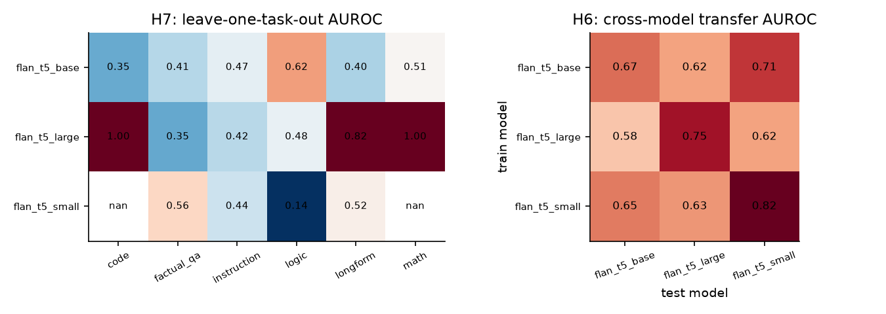

## 11. Error analysis

| model | error_type | n |
|---|---|---|
| flan_t5_base | code_failure | 146 |
| flan_t5_base | contradiction | 23 |
| flan_t5_base | factual_hallucination | 108 |
| flan_t5_base | incomplete_answer | 8 |
| flan_t5_base | instruction_violation | 146 |
| flan_t5_base | logical_error | 68 |
| flan_t5_base | mathematical_error | 183 |
| flan_t5_base | reasoning_error | 118 |
| flan_t5_large | code_failure | 41 |
| flan_t5_large | contradiction | 20 |
| flan_t5_large | factual_hallucination | 40 |
| flan_t5_large | incomplete_answer | 37 |
| flan_t5_large | instruction_violation | 78 |
| flan_t5_large | logical_error | 54 |
| flan_t5_large | mathematical_error | 83 |
| flan_t5_large | reasoning_error | 34 |
| flan_t5_small | contradiction | 44 |
| flan_t5_small | factual_hallucination | 208 |
| flan_t5_small | incomplete_answer | 301 |
| flan_t5_small | instruction_violation | 254 |
| flan_t5_small | logical_error | 144 |
| flan_t5_small | mathematical_error | 296 |
| flan_t5_small | reasoning_error | 213 |

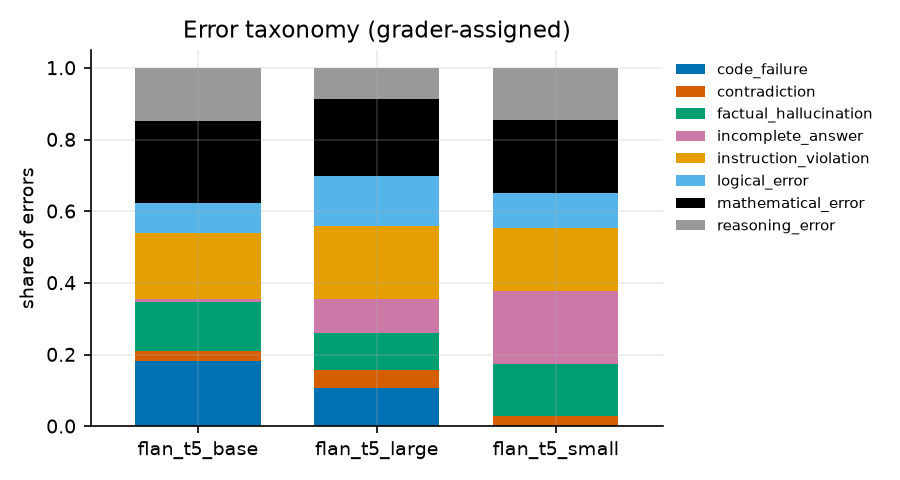

Detectability by error type (AUROC separating correct answers from each error type; pooled; test):

| model | scorer | error_type | n_errors | n_correct | auroc | lo | hi |
|---|---|---|---|---|---|---|---|
| flan_t5_small | ESD_core(A+B+C+D+E) | contradiction | 9 | 76 | 0.868 | 0.779 | 0.942 |
| flan_t5_small | ESD_core(A+B+C+D+E) | factual_hallucination | 51 | 76 | 0.662 | 0.563 | 0.761 |
| flan_t5_small | ESD_core(A+B+C+D+E) | incomplete_answer | 49 | 76 | 0.931 | 0.879 | 0.971 |
| flan_t5_small | ESD_core(A+B+C+D+E) | instruction_violation | 44 | 76 | 0.778 | 0.686 | 0.859 |
| flan_t5_small | ESD_core(A+B+C+D+E) | logical_error | 29 | 76 | 0.811 | 0.729 | 0.884 |
| flan_t5_small | ESD_core(A+B+C+D+E) | mathematical_error | 58 | 76 | 0.904 | 0.847 | 0.952 |
| flan_t5_small | ESD_core(A+B+C+D+E) | reasoning_error | 47 | 76 | 0.884 | 0.822 | 0.938 |
| flan_t5_small | B3_token_entropy | contradiction | 9 | 76 | 0.519 | 0.339 | 0.686 |
| flan_t5_small | B3_token_entropy | factual_hallucination | 51 | 76 | 0.609 | 0.503 | 0.709 |
| flan_t5_small | B3_token_entropy | incomplete_answer | 49 | 76 | 0.753 | 0.665 | 0.846 |
| flan_t5_small | B3_token_entropy | instruction_violation | 44 | 76 | 0.725 | 0.603 | 0.828 |
| flan_t5_small | B3_token_entropy | logical_error | 29 | 76 | 0.255 | 0.170 | 0.357 |
| flan_t5_small | B3_token_entropy | mathematical_error | 58 | 76 | 0.757 | 0.666 | 0.847 |
| flan_t5_small | B3_token_entropy | reasoning_error | 47 | 76 | 0.552 | 0.450 | 0.649 |
| flan_t5_small | B5_llm_judge_self | contradiction | 9 | 76 | 0.295 | 0.146 | 0.456 |
| flan_t5_small | B5_llm_judge_self | factual_hallucination | 51 | 76 | 0.779 | 0.699 | 0.858 |
| flan_t5_small | B5_llm_judge_self | incomplete_answer | 49 | 76 | 0.605 | 0.502 | 0.698 |
| flan_t5_small | B5_llm_judge_self | instruction_violation | 44 | 76 | 0.571 | 0.461 | 0.682 |
| flan_t5_small | B5_llm_judge_self | logical_error | 29 | 76 | 0.790 | 0.694 | 0.881 |
| flan_t5_small | B5_llm_judge_self | mathematical_error | 58 | 76 | 0.503 | 0.397 | 0.602 |
| flan_t5_small | B5_llm_judge_self | reasoning_error | 47 | 76 | 0.246 | 0.166 | 0.329 |
| flan_t5_base | ESD_core(A+B+C+D+E) | code_failure | 25 | 76 | 0.809 | 0.723 | 0.892 |
| flan_t5_base | ESD_core(A+B+C+D+E) | factual_hallucination | 24 | 76 | 0.516 | 0.401 | 0.633 |
| flan_t5_base | ESD_core(A+B+C+D+E) | instruction_violation | 29 | 76 | 0.600 | 0.493 | 0.713 |
| flan_t5_base | ESD_core(A+B+C+D+E) | logical_error | 16 | 76 | 0.523 | 0.352 | 0.680 |
| flan_t5_base | ESD_core(A+B+C+D+E) | mathematical_error | 38 | 76 | 0.854 | 0.776 | 0.924 |
| flan_t5_base | ESD_core(A+B+C+D+E) | reasoning_error | 23 | 76 | 0.613 | 0.469 | 0.738 |
| flan_t5_base | B3_token_entropy | code_failure | 25 | 76 | 0.435 | 0.333 | 0.549 |
| flan_t5_base | B3_token_entropy | factual_hallucination | 24 | 76 | 0.723 | 0.612 | 0.832 |
| flan_t5_base | B3_token_entropy | instruction_violation | 29 | 76 | 0.919 | 0.863 | 0.966 |
| flan_t5_base | B3_token_entropy | logical_error | 16 | 76 | 0.208 | 0.127 | 0.315 |
| flan_t5_base | B3_token_entropy | mathematical_error | 38 | 76 | 0.670 | 0.578 | 0.764 |
| flan_t5_base | B3_token_entropy | reasoning_error | 23 | 76 | 0.525 | 0.415 | 0.638 |
| flan_t5_base | B5_llm_judge_self | code_failure | 25 | 76 | 0.612 | 0.508 | 0.717 |
| flan_t5_base | B5_llm_judge_self | factual_hallucination | 24 | 76 | 0.769 | 0.640 | 0.880 |
| flan_t5_base | B5_llm_judge_self | instruction_violation | 29 | 76 | 0.352 | 0.236 | 0.459 |
| flan_t5_base | B5_llm_judge_self | logical_error | 16 | 76 | 0.720 | 0.568 | 0.851 |
| flan_t5_base | B5_llm_judge_self | mathematical_error | 38 | 76 | 0.622 | 0.518 | 0.716 |
| flan_t5_base | B5_llm_judge_self | reasoning_error | 23 | 76 | 0.400 | 0.262 | 0.535 |
| flan_t5_large | ESD_core(A+B+C+D+E) | factual_hallucination | 9 | 42 | 0.505 | 0.299 | 0.707 |
| flan_t5_large | ESD_core(A+B+C+D+E) | instruction_violation | 12 | 42 | 0.679 | 0.526 | 0.820 |
| flan_t5_large | ESD_core(A+B+C+D+E) | logical_error | 13 | 42 | 0.767 | 0.640 | 0.881 |
| flan_t5_large | ESD_core(A+B+C+D+E) | mathematical_error | 16 | 42 | 0.832 | 0.692 | 0.947 |
| flan_t5_large | B3_token_entropy | factual_hallucination | 9 | 42 | 0.384 | 0.214 | 0.573 |
| flan_t5_large | B3_token_entropy | instruction_violation | 12 | 42 | 0.942 | 0.872 | 0.992 |
| flan_t5_large | B3_token_entropy | logical_error | 13 | 42 | 0.181 | 0.082 | 0.310 |
| flan_t5_large | B3_token_entropy | mathematical_error | 16 | 42 | 0.289 | 0.164 | 0.432 |
| flan_t5_large | B5_llm_judge_self | factual_hallucination | 9 | 42 | 0.365 | 0.205 | 0.534 |
| flan_t5_large | B5_llm_judge_self | instruction_violation | 12 | 42 | 0.474 | 0.285 | 0.661 |
| flan_t5_large | B5_llm_judge_self | logical_error | 13 | 42 | 0.676 | 0.537 | 0.802 |
| flan_t5_large | B5_llm_judge_self | mathematical_error | 16 | 42 | 0.443 | 0.301 | 0.577 |

Expressed-stance vs correctness (overconfidence / underconfidence in the *text*):

| model | overconfident_wrong_share(net_certainty>0 | wrong) | hedged_correct_share(any_hedge | correct) | hedged_wrong_share(any_hedge | wrong) | n_wrong | n_correct |
|---|---|---|---|---|---|
| flan_t5_small | 0.453 | 0.000 | 0.000 | 287 | 76 |
| flan_t5_base | 0.472 | 0.013 | 0.019 | 159 | 76 |
| flan_t5_large | 0.535 | 0.048 | 0.014 | 71 | 42 |

Taxonomy note: grader-assigned types are `factual_hallucination` (wrong MC option), `mathematical_error`, `logical_error`, `reasoning_error`/`contradiction` (long-form), `instruction_violation`, `code_failure`, `incomplete_answer`. 'Unsupported claim' is only proxied (novel-word ratio); 'irrelevant answer' and 'uncertainty failure' are not separately labelled - **Not evaluated** as distinct classes.

## 12. Adversarial testing

Natural adversarial subsets (flagging = top 40% risk; wrong-answer cases want high flag rate, correct-answer cases low):

| model | case | scorer | n | subset_error_rate | flag_rate | lo | hi | reading |
|---|---|---|---|---|---|---|---|---|
| flan_t5_small | 1 confident wrong | ESD_core (logreg) | 136 | 1.000 | 0.478 | 0.396 | 0.561 | detection (higher=better) |
| flan_t5_small | 1 confident wrong | B3 token entropy | 136 | 1.000 | 0.096 | 0.057 | 0.157 | detection (higher=better) |
| flan_t5_small | 1 confident wrong | B5 LLM judge (self) | 136 | 1.000 | 0.382 | 0.305 | 0.466 | detection (higher=better) |
| flan_t5_small | 2 uncertain correct | ESD_core (logreg) | 18 | 0.000 | 0.056 | 0.010 | 0.258 | false alarm (lower=better) |
| flan_t5_small | 2 uncertain correct | B3 token entropy | 18 | 0.000 | 0.722 | 0.491 | 0.875 | false alarm (lower=better) |
| flan_t5_small | 2 uncertain correct | B5 LLM judge (self) | 18 | 0.000 | 0.611 | 0.386 | 0.797 | false alarm (lower=better) |
| flan_t5_small | 3 emotionally neutral wrong | ESD_core (logreg) | 156 | 1.000 | 0.481 | 0.404 | 0.559 | detection (higher=better) |
| flan_t5_small | 3 emotionally neutral wrong | B3 token entropy | 156 | 1.000 | 0.526 | 0.448 | 0.602 | detection (higher=better) |
| flan_t5_small | 3 emotionally neutral wrong | B5 LLM judge (self) | 156 | 1.000 | 0.519 | 0.441 | 0.596 | detection (higher=better) |
| flan_t5_small | 4 emotionally expressive correct | ESD_core (logreg) | 32 | 0.000 | 0.062 | 0.017 | 0.201 | false alarm (lower=better) |
| flan_t5_small | 4 emotionally expressive correct | B3 token entropy | 32 | 0.000 | 0.281 | 0.156 | 0.454 | false alarm (lower=better) |
| flan_t5_small | 4 emotionally expressive correct | B5 LLM judge (self) | 32 | 0.000 | 0.344 | 0.204 | 0.517 | false alarm (lower=better) |
| flan_t5_small | 5 long correct | ESD_core (logreg) | 4 | 0.000 | 0.000 | 0.000 | 0.490 | false alarm (lower=better) |
| flan_t5_small | 5 long correct | B3 token entropy | 4 | 0.000 | 1.000 | 0.510 | 1.000 | false alarm (lower=better) |
| flan_t5_small | 5 long correct | B5 LLM judge (self) | 4 | 0.000 | 0.000 | 0.000 | 0.490 | false alarm (lower=better) |
| flan_t5_small | 6 short wrong | ESD_core (logreg) | 81 | 1.000 | 0.321 | 0.229 | 0.429 | detection (higher=better) |
| flan_t5_small | 6 short wrong | B3 token entropy | 81 | 1.000 | 0.469 | 0.364 | 0.577 | detection (higher=better) |
| flan_t5_small | 6 short wrong | B5 LLM judge (self) | 81 | 1.000 | 0.654 | 0.546 | 0.749 | detection (higher=better) |
| flan_t5_small | 7 correct with negative language | ESD_core (logreg) | 30 | 0.000 | 0.100 | 0.035 | 0.256 | false alarm (lower=better) |
| flan_t5_small | 7 correct with negative language | B3 token entropy | 30 | 0.000 | 0.100 | 0.035 | 0.256 | false alarm (lower=better) |
| flan_t5_small | 7 correct with negative language | B5 LLM judge (self) | 30 | 0.000 | 0.300 | 0.167 | 0.479 | false alarm (lower=better) |
| flan_t5_small | 8 wrong, calm + confident language | ESD_core (logreg) | 156 | 1.000 | 0.481 | 0.404 | 0.559 | detection (higher=better) |
| flan_t5_small | 8 wrong, calm + confident language | B3 token entropy | 156 | 1.000 | 0.526 | 0.448 | 0.602 | detection (higher=better) |
| flan_t5_small | 8 wrong, calm + confident language | B5 LLM judge (self) | 156 | 1.000 | 0.519 | 0.441 | 0.596 | detection (higher=better) |
| flan_t5_small | 9 contradictory answer | ESD_core (logreg) | 0 | n/a | n/a | n/a | n/a | detection (higher=better) |
| flan_t5_small | 9 contradictory answer | B3 token entropy | 0 | n/a | n/a | n/a | n/a | detection (higher=better) |
| flan_t5_small | 9 contradictory answer | B5 LLM judge (self) | 0 | n/a | n/a | n/a | n/a | detection (higher=better) |
| flan_t5_base | 1 confident wrong | ESD_core (logreg) | 61 | 1.000 | 0.475 | 0.355 | 0.598 | detection (higher=better) |
| flan_t5_base | 1 confident wrong | B3 token entropy | 61 | 1.000 | 0.016 | 0.003 | 0.087 | detection (higher=better) |
| flan_t5_base | 1 confident wrong | B5 LLM judge (self) | 61 | 1.000 | 0.361 | 0.252 | 0.486 | detection (higher=better) |
| flan_t5_base | 2 uncertain correct | ESD_core (logreg) | 19 | 0.000 | 0.316 | 0.154 | 0.540 | false alarm (lower=better) |
| flan_t5_base | 2 uncertain correct | B3 token entropy | 19 | 0.000 | 0.947 | 0.754 | 0.991 | false alarm (lower=better) |
| flan_t5_base | 2 uncertain correct | B5 LLM judge (self) | 19 | 0.000 | 0.474 | 0.273 | 0.683 | false alarm (lower=better) |
| flan_t5_base | 3 emotionally neutral wrong | ESD_core (logreg) | 76 | 1.000 | 0.447 | 0.341 | 0.559 | detection (higher=better) |
| flan_t5_base | 3 emotionally neutral wrong | B3 token entropy | 76 | 1.000 | 0.368 | 0.269 | 0.481 | detection (higher=better) |
| flan_t5_base | 3 emotionally neutral wrong | B5 LLM judge (self) | 76 | 1.000 | 0.408 | 0.304 | 0.520 | detection (higher=better) |
| flan_t5_base | 4 emotionally expressive correct | ESD_core (logreg) | 18 | 0.000 | 0.389 | 0.203 | 0.614 | false alarm (lower=better) |
| flan_t5_base | 4 emotionally expressive correct | B3 token entropy | 18 | 0.000 | 0.333 | 0.163 | 0.563 | false alarm (lower=better) |
| flan_t5_base | 4 emotionally expressive correct | B5 LLM judge (self) | 18 | 0.000 | 0.389 | 0.203 | 0.614 | false alarm (lower=better) |
| flan_t5_base | 5 long correct | ESD_core (logreg) | 16 | 0.000 | 0.500 | 0.280 | 0.720 | false alarm (lower=better) |
| flan_t5_base | 5 long correct | B3 token entropy | 16 | 0.000 | 0.312 | 0.142 | 0.556 | false alarm (lower=better) |
| flan_t5_base | 5 long correct | B5 LLM judge (self) | 16 | 0.000 | 0.250 | 0.102 | 0.495 | false alarm (lower=better) |
| flan_t5_base | 6 short wrong | ESD_core (logreg) | 41 | 1.000 | 0.171 | 0.085 | 0.313 | detection (higher=better) |
| flan_t5_base | 6 short wrong | B3 token entropy | 41 | 1.000 | 0.537 | 0.387 | 0.679 | detection (higher=better) |
| flan_t5_base | 6 short wrong | B5 LLM judge (self) | 41 | 1.000 | 0.683 | 0.530 | 0.804 | detection (higher=better) |
| flan_t5_base | 7 correct with negative language | ESD_core (logreg) | 23 | 0.000 | 0.391 | 0.222 | 0.592 | false alarm (lower=better) |
| flan_t5_base | 7 correct with negative language | B3 token entropy | 23 | 0.000 | 0.130 | 0.045 | 0.321 | false alarm (lower=better) |
| flan_t5_base | 7 correct with negative language | B5 LLM judge (self) | 23 | 0.000 | 0.391 | 0.222 | 0.592 | false alarm (lower=better) |
| flan_t5_base | 8 wrong, calm + confident language | ESD_core (logreg) | 75 | 1.000 | 0.453 | 0.346 | 0.566 | detection (higher=better) |
| flan_t5_base | 8 wrong, calm + confident language | B3 token entropy | 75 | 1.000 | 0.360 | 0.261 | 0.473 | detection (higher=better) |
| flan_t5_base | 8 wrong, calm + confident language | B5 LLM judge (self) | 75 | 1.000 | 0.413 | 0.309 | 0.526 | detection (higher=better) |
| flan_t5_base | 9 contradictory answer | ESD_core (logreg) | 0 | n/a | n/a | n/a | n/a | detection (higher=better) |
| flan_t5_base | 9 contradictory answer | B3 token entropy | 0 | n/a | n/a | n/a | n/a | detection (higher=better) |
| flan_t5_base | 9 contradictory answer | B5 LLM judge (self) | 0 | n/a | n/a | n/a | n/a | detection (higher=better) |
| flan_t5_large | 1 confident wrong | ESD_core (logreg) | 33 | 1.000 | 0.485 | 0.325 | 0.648 | detection (higher=better) |
| flan_t5_large | 1 confident wrong | B3 token entropy | 33 | 1.000 | 0.000 | 0.000 | 0.104 | detection (higher=better) |
| flan_t5_large | 1 confident wrong | B5 LLM judge (self) | 33 | 1.000 | 0.424 | 0.272 | 0.592 | detection (higher=better) |
| flan_t5_large | 2 uncertain correct | ESD_core (logreg) | 16 | 0.000 | 0.375 | 0.185 | 0.614 | false alarm (lower=better) |
| flan_t5_large | 2 uncertain correct | B3 token entropy | 16 | 0.000 | 1.000 | 0.806 | 1.000 | false alarm (lower=better) |
| flan_t5_large | 2 uncertain correct | B5 LLM judge (self) | 16 | 0.000 | 0.438 | 0.231 | 0.668 | false alarm (lower=better) |
| flan_t5_large | 3 emotionally neutral wrong | ESD_core (logreg) | 34 | 1.000 | 0.559 | 0.395 | 0.711 | detection (higher=better) |
| flan_t5_large | 3 emotionally neutral wrong | B3 token entropy | 34 | 1.000 | 0.294 | 0.168 | 0.462 | detection (higher=better) |
| flan_t5_large | 3 emotionally neutral wrong | B5 LLM judge (self) | 34 | 1.000 | 0.412 | 0.264 | 0.578 | detection (higher=better) |
| flan_t5_large | 4 emotionally expressive correct | ESD_core (logreg) | 14 | 0.000 | 0.286 | 0.117 | 0.546 | false alarm (lower=better) |
| flan_t5_large | 4 emotionally expressive correct | B3 token entropy | 14 | 0.000 | 0.714 | 0.454 | 0.883 | false alarm (lower=better) |
| flan_t5_large | 4 emotionally expressive correct | B5 LLM judge (self) | 14 | 0.000 | 0.500 | 0.268 | 0.732 | false alarm (lower=better) |
| flan_t5_large | 5 long correct | ESD_core (logreg) | 8 | 0.000 | 0.500 | 0.215 | 0.785 | false alarm (lower=better) |
| flan_t5_large | 5 long correct | B3 token entropy | 8 | 0.000 | 0.500 | 0.215 | 0.785 | false alarm (lower=better) |
| flan_t5_large | 5 long correct | B5 LLM judge (self) | 8 | 0.000 | 0.500 | 0.215 | 0.785 | false alarm (lower=better) |
| flan_t5_large | 6 short wrong | ESD_core (logreg) | 21 | 1.000 | 0.524 | 0.324 | 0.717 | detection (higher=better) |
| flan_t5_large | 6 short wrong | B3 token entropy | 21 | 1.000 | 0.476 | 0.283 | 0.676 | detection (higher=better) |
| flan_t5_large | 6 short wrong | B5 LLM judge (self) | 21 | 1.000 | 0.429 | 0.245 | 0.635 | detection (higher=better) |
| flan_t5_large | 7 correct with negative language | ESD_core (logreg) | 14 | 0.000 | 0.071 | 0.013 | 0.315 | false alarm (lower=better) |
| flan_t5_large | 7 correct with negative language | B3 token entropy | 14 | 0.000 | 0.429 | 0.214 | 0.674 | false alarm (lower=better) |
| flan_t5_large | 7 correct with negative language | B5 LLM judge (self) | 14 | 0.000 | 0.714 | 0.454 | 0.883 | false alarm (lower=better) |
| flan_t5_large | 8 wrong, calm + confident language | ESD_core (logreg) | 33 | 1.000 | 0.576 | 0.408 | 0.728 | detection (higher=better) |
| flan_t5_large | 8 wrong, calm + confident language | B3 token entropy | 33 | 1.000 | 0.303 | 0.174 | 0.473 | detection (higher=better) |
| flan_t5_large | 8 wrong, calm + confident language | B5 LLM judge (self) | 33 | 1.000 | 0.394 | 0.247 | 0.563 | detection (higher=better) |
| flan_t5_large | 9 contradictory answer | ESD_core (logreg) | 0 | n/a | n/a | n/a | n/a | detection (higher=better) |
| flan_t5_large | 9 contradictory answer | B3 token entropy | 0 | n/a | n/a | n/a | n/a | detection (higher=better) |
| flan_t5_large | 9 contradictory answer | B5 LLM judge (self) | 0 | n/a | n/a | n/a | n/a | detection (higher=better) |

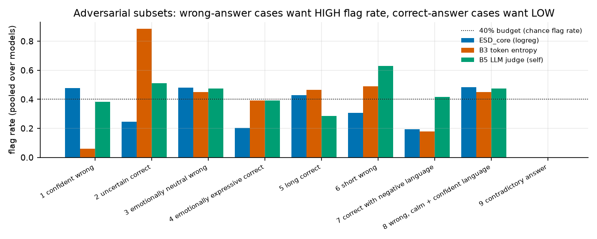

Controlled text attacks (token/candidate features cannot be changed by editing text and are left as generated):

| model | attack | scorer | n_attacked | mean_risk_before | mean_risk_after | flag_rate_before | flag_rate_after | auroc_before | auroc_after |
|---|---|---|---|---|---|---|---|---|---|
| flan_t5_small | confidence injection on WRONG answers | ESD_core | 287 | 0.876 | 0.682 | 0.477 | 0.394 | 0.833 | 0.628 |
| flan_t5_small | confidence injection on WRONG answers | ESD_text(A+B+C) | 287 | 0.874 | 0.547 | 0.470 | 0.153 | 0.793 | 0.470 |
| flan_t5_small | confidence injection on WRONG answers | D_token | 287 | 0.816 | 0.816 | 0.422 | 0.422 | 0.649 | 0.649 |
| flan_t5_small | confidence injection on WRONG answers | LLM judge (flan_t5_large) P(yes) | 287 | 0.561 | 0.508 | 0.652 | 0.554 | n/a | n/a |
| flan_t5_small | hedge injection on CORRECT answers | ESD_core | 76 | 0.564 | 0.927 | 0.105 | 0.724 | 0.833 | 0.260 |
| flan_t5_small | hedge injection on CORRECT answers | ESD_text(A+B+C) | 76 | 0.598 | 0.952 | 0.132 | 0.737 | 0.793 | 0.239 |
| flan_t5_small | hedge injection on CORRECT answers | D_token | 76 | 0.787 | 0.787 | 0.316 | 0.316 | 0.649 | 0.649 |
| flan_t5_small | hedge injection on CORRECT answers | LLM judge (flan_t5_large) P(yes) | 76 | 0.600 | 0.546 | 0.737 | 0.632 | n/a | n/a |
| flan_t5_small | prompt injection (verifier) on WRONG answers | ESD_core | 287 | 0.876 | 0.985 | 0.477 | 0.993 | 0.833 | 0.985 |
| flan_t5_small | prompt injection (verifier) on WRONG answers | ESD_text(A+B+C) | 287 | 0.874 | 0.963 | 0.470 | 0.822 | 0.793 | 0.930 |
| flan_t5_small | prompt injection (verifier) on WRONG answers | D_token | 287 | 0.816 | 0.816 | 0.422 | 0.422 | 0.649 | 0.649 |
| flan_t5_small | prompt injection (verifier) on WRONG answers | LLM judge (flan_t5_large) P(yes) | 287 | 0.561 | 0.459 | 0.652 | 0.314 | n/a | n/a |
| flan_t5_base | confidence injection on WRONG answers | ESD_core | 159 | 0.702 | 0.846 | 0.465 | 0.761 | 0.668 | 0.840 |
| flan_t5_base | confidence injection on WRONG answers | ESD_text(A+B+C) | 159 | 0.696 | 0.590 | 0.459 | 0.440 | 0.643 | 0.537 |
| flan_t5_base | confidence injection on WRONG answers | D_token | 159 | 0.668 | 0.668 | 0.478 | 0.478 | 0.637 | 0.637 |
| flan_t5_base | confidence injection on WRONG answers | LLM judge (flan_t5_large) P(yes) | 159 | 0.395 | 0.384 | 0.390 | 0.296 | n/a | n/a |
| flan_t5_base | hedge injection on CORRECT answers | ESD_core | 76 | 0.560 | 0.788 | 0.263 | 0.671 | 0.668 | 0.340 |
| flan_t5_base | hedge injection on CORRECT answers | ESD_text(A+B+C) | 76 | 0.602 | 0.769 | 0.276 | 0.605 | 0.643 | 0.359 |
| flan_t5_base | hedge injection on CORRECT answers | D_token | 76 | 0.616 | 0.616 | 0.237 | 0.237 | 0.637 | 0.637 |
| flan_t5_base | hedge injection on CORRECT answers | LLM judge (flan_t5_large) P(yes) | 76 | 0.422 | 0.457 | 0.461 | 0.355 | n/a | n/a |
| flan_t5_base | prompt injection (verifier) on WRONG answers | ESD_core | 159 | 0.702 | 0.978 | 0.465 | 0.987 | 0.668 | 0.984 |
| flan_t5_base | prompt injection (verifier) on WRONG answers | ESD_text(A+B+C) | 159 | 0.696 | 0.962 | 0.459 | 0.987 | 0.643 | 0.975 |
| flan_t5_base | prompt injection (verifier) on WRONG answers | D_token | 159 | 0.668 | 0.668 | 0.478 | 0.478 | 0.637 | 0.637 |
| flan_t5_base | prompt injection (verifier) on WRONG answers | LLM judge (flan_t5_large) P(yes) | 159 | 0.395 | 0.404 | 0.390 | 0.239 | n/a | n/a |
| flan_t5_large | confidence injection on WRONG answers | ESD_core | 71 | 0.733 | 0.462 | 0.479 | 0.268 | 0.716 | 0.415 |
| flan_t5_large | confidence injection on WRONG answers | ESD_text(A+B+C) | 71 | 0.683 | 0.523 | 0.479 | 0.324 | 0.631 | 0.397 |
| flan_t5_large | confidence injection on WRONG answers | D_token | 71 | 0.702 | 0.702 | 0.493 | 0.493 | 0.667 | 0.667 |
| flan_t5_large | confidence injection on WRONG answers | LLM judge (flan_t5_large) P(yes) | 71 | 0.340 | 0.335 | 0.282 | 0.183 | n/a | n/a |
| flan_t5_large | hedge injection on CORRECT answers | ESD_core | 42 | 0.547 | 0.933 | 0.262 | 0.976 | 0.716 | 0.165 |
| flan_t5_large | hedge injection on CORRECT answers | ESD_text(A+B+C) | 42 | 0.597 | 0.993 | 0.262 | 1.000 | 0.631 | 0.001 |
| flan_t5_large | hedge injection on CORRECT answers | D_token | 42 | 0.593 | 0.593 | 0.238 | 0.238 | 0.667 | 0.667 |
| flan_t5_large | hedge injection on CORRECT answers | LLM judge (flan_t5_large) P(yes) | 42 | 0.323 | 0.368 | 0.286 | 0.310 | n/a | n/a |
| flan_t5_large | prompt injection (verifier) on WRONG answers | ESD_core | 71 | 0.733 | 0.820 | 0.479 | 0.718 | 0.716 | 0.822 |
| flan_t5_large | prompt injection (verifier) on WRONG answers | ESD_text(A+B+C) | 71 | 0.683 | 0.904 | 0.479 | 1.000 | 0.631 | 0.964 |
| flan_t5_large | prompt injection (verifier) on WRONG answers | D_token | 71 | 0.702 | 0.702 | 0.493 | 0.493 | 0.667 | 0.667 |
| flan_t5_large | prompt injection (verifier) on WRONG answers | LLM judge (flan_t5_large) P(yes) | 71 | 0.340 | 0.320 | 0.282 | 0.070 | n/a | n/a |

## 13. Statistical analysis and pre-specified verdicts

Tests used: **percentile cluster bootstrap** (1000 resamples; resampling items) for CIs of AUROC/AUPRC; **paired bootstrap** for ΔAUROC between scorers on the same items; **paired permutation test** (swap the two scores item-wise) for AUROC differences; **permutation test vs chance** for AUROC>0.5; **exact McNemar** for paired accepted-error outcomes; **Wilcoxon signed-rank** across (model, task) cells; **Holm** step-down correction within each family of tests; effect sizes as ΔAUROC (and Cohen's h available in `stattests.py`). Class balance matters for AUPRC, so base error rate is shown beside it.

**VERDICT RULES (fixed before results):** SUPPORTED if the stated CI criterion holds in >= 2/3 of models (or all cells where stated); WEAK/INCONCLUSIVE if the point estimate beats chance but the criterion fails; NOT SUPPORTED otherwise.

| hypothesis | verdict | evidence |
|---|---|---|
| H1 affective signal | **WEAK/INCONCLUSIVE (pooled rule)** | affect-only AUROC CI lower bound > 0.5 in >= 2/3 of models. flan_t5_small: 0.72 [0.65, 0.78], flan_t5_base: 0.58 [0.50, 0.66], flan_t5_large: 0.59 [0.48, 0.69] || **within-task verdict (post-hoc, stricter, treated as primary): WEAK/INCONCLUSIVE** - flan_t5_base: 0.55 [0.46, 0.63], flan_t5_large: 0.60 [0.47, 0.67], flan_t5_small: 0.59 [0.50, 0.68] |
| H2 epistemic signal | **SUPPORTED (pooled rule)** | epistemic-only AUROC CI lower bound > 0.5 in >= 2/3 of models. flan_t5_small: 0.56 [0.52, 0.62], flan_t5_base: 0.59 [0.53, 0.66], flan_t5_large: 0.62 [0.51, 0.72] || **within-task verdict (post-hoc, stricter, treated as primary): NOT SUPPORTED** - flan_t5_base: 0.54 [0.47, 0.60], flan_t5_large: 0.60 [0.46, 0.68], flan_t5_small: 0.52 [0.46, 0.57] |
| H3 semantic consistency | **SUPPORTED (pooled rule)** | semantic-only (text) AUROC CI lower bound > 0.5 in >= 2/3 of models. flan_t5_small: 0.69 [0.61, 0.76], flan_t5_base: 0.59 [0.51, 0.66], flan_t5_large: 0.62 [0.51, 0.73] || **within-task verdict (post-hoc, stricter, treated as primary): WEAK/INCONCLUSIVE** - flan_t5_base: 0.54 [0.45, 0.62], flan_t5_large: 0.66 [0.51, 0.76], flan_t5_small: 0.60 [0.51, 0.67] |
| H3b cross-sample semantic disagreement (baseline B6) | **WEAK/INCONCLUSIVE** | flan_t5_small: 0.58 [0.51, 0.65]; flan_t5_base: 0.49 [0.41, 0.57]; flan_t5_large: 0.50 [0.39, 0.61] |
| H4 combination beats every single family | **WEAK/INCONCLUSIVE** | paired-bootstrap ΔAUROC vs the BEST single family, CI lower bound > 0 in >= 2 models. flan_t5_base: best single=E_candidate (0.65); ESD core 0.68; ΔAUROC 0.030 [-0.035, 0.096]; flan_t5_large: best single=E_candidate (0.73); ESD core 0.73; ΔAUROC 0.004 [-0.080, 0.093]; flan_t5_small: best single=A_affective (0.72); ESD core 0.83; ΔAUROC 0.115 [0.052, 0.170] |
| H5 harness reduces accepted errors | **WEAK/INCONCLUSIVE** | at 40% verification budget: wrong answers reaching the user per request, no-harness -> ESD: flan_t5_small: 0.791 -> 0.490; flan_t5_base: 0.677 -> 0.370; flan_t5_large: 0.628 -> 0.345. ESD significantly better (Holm McNemar p<0.05) than entropy/judge routing in 0 of 6 paired tests. (Note: this compares leakage under the same verifier; see section 9 for what the verifier alone achieves.) |
| H6 model generalisation (sizes of ONE family) | **SUPPORTED** | cross-model transfer AUROC CI lower bound > 0.5 in 6/6 off-diagonal cells. Different model *families*: Not evaluated. |
| H7 task generalisation | **WEAK/INCONCLUSIVE** | leave-one-task-out AUROC CI lower bound > 0.5 on >= 4/6 held-out tasks for >= 2 models. Tasks passing per model: flan_t5_base: 0/6, flan_t5_large: 3/6, flan_t5_small: 0/6 |

## 14. Discussion

*Hand-written by the experimenter after reading the generated tables (everything above and below this section is auto-generated). Numbers quoted here are copied from those tables.*

**Short answer to the research question: mixed, leaning negative for the ESD hypothesis in this regime.**
Affective and epistemic characteristics of the generated text did **not** give a reliable error signal that survives controls; the signal that does exist comes mainly from token-level and sampling-based uncertainty and from task structure, and the combined ESD score is not reliably better than simple baselines or than a length/difficulty/task control.

**1. Pooled AUROC is misleading here, and I changed my headline metric because of it (post-hoc).**
A scorer that sees only the task and predicts its base error rate reaches pooled AUROC 0.79 / 0.67 / 0.73 (small/base/large), roughly equal to pooled ESD core (0.83 / 0.68 / 0.73). Raw baselines such as token entropy even fall below 0.5 pooled on the large model because token statistics differ by task. I therefore added within-task macro AUROC (section 9.2b) and treat it as primary. This was decided after seeing the task-prior control, so it is a post-hoc choice; both views are reported.

**2. What the within-task numbers say.** ESD core: 0.69 [0.63, 0.77], 0.58 [0.50, 0.66], 0.72 [0.57, 0.80]. A control that knows only task, answer length, question length and difficulty gets 0.67, 0.73, 0.71 - i.e. ESD is not clearly better than it, and is worse for the base model. The strongest single signals were model-dependent: self-consistency disagreement on the large model (0.79 [0.70, 0.85]), the LLM judge (self and independent) at about 0.61-0.64 across models, candidate agreement on large (0.73). Affect-only (0.59, 0.55, 0.60) and epistemic-only (0.52, 0.54, 0.60) have confidence intervals that include 0.5 in every model. So H1 and H3 are inconclusive and H2 is not supported when the task confound is removed; H2 and H3 look "supported" only under the pre-specified *pooled* rule, whose lower CI bounds sit barely above 0.5 (e.g. 0.52, 0.53, 0.51 for epistemic).

**3. Why affect/epistemic signals are weak here - a data-regime explanation, not proof of absence.** The epistemic channel is nearly empty: hedges appear in 0.0-4.8% of correct and 0.0-2.0% of wrong answers; 45-54% of wrong answers contain assertive/certainty cues, so wrong answers are typically *stated* as confidently as right ones (the "calm, confident wrong answer" failure mode). Many outputs are a few tokens long. Flan-T5 does not produce emotive or hedged prose, so affect/epistemic analysers have little to read. This says nothing about chat-tuned larger models.

**4. Some signal survives controls, but it is modest.** After rank-residualising task, answer length, question length and difficulty, the pooled score still correlates with errors (partial Spearman 0.28, p=0.001; 0.14, p=0.037; 0.17, p=0.072). The label-shuffle placebo (30 shuffles) gives AUROC null 99th percentiles of 0.63 / 0.58 / 0.69 versus real 0.83 / 0.67 / 0.72. Incremental AUROC of ESD over the controls is significant only for the small model pooled (+0.175, 95% CI [0.098, 0.251]); for base (+0.058, [-0.026, 0.136]) and large (+0.064, [-0.032, 0.158]) it is not. A Wilcoxon test across (model, task) cells finds ESD core better than epistemic-only (median ΔAUROC 0.177, p=0.002) and token-only (0.072, p=0.027) but not significantly better than the control (0.045, p=0.36) or candidate-only (0.013, p=0.20). These Wilcoxon p-values are uncorrected within that family.

**5. Structural artefacts.** In-task AUROCs near 1.0 on the synthetic *logic* and *code* tasks (and the control winning on *instruction*, 0.92-0.94, because pass/fail there is dictated by length-type constraints) mostly reflect failure modes tied to output form (which answer token or what format the model emits), not affect or epistemic stance. Treat those cells as evidence that the pipeline can detect *structured* failures, not that ESD's namesake signals work. Leave-one-task-out transfer is poor: no held-out task has a CI lower bound above 0.5 for small and base, 3/6 for large (two of these have n=17 and an in-task AUROC of 1.0 for the same structural reason). The small model's logic transfer is *inverted* (0.14 [0.05, 0.24]), meaning a rule learned on other tasks anti-predicts errors there.

**6. Cross-model transfer (sizes of one family) is weakly positive.** All six off-diagonal pooled AUROCs have CI lower bounds at or just above 0.5 (0.500-0.653; point estimates 0.583-0.714; the weakest, base→large and large→base, are 0.510 and 0.500), which satisfies the pre-specified rule but is pooled (task-confounded) and thin; I would not call H6 established. Cross-*family* transfer was not tested.

**7. The verification/repair loop mostly works by abstaining, not by repairing.** At a 40% verification budget the number of wrong answers reaching the user falls (0.791 → 0.490, 0.677 → 0.370, 0.628 → 0.345), but this is mostly the effect of the verifier rejecting answers and the loop abstaining (coverage falls to 0.69 / 0.63 / 0.69): *random* routing gives 0.521 / 0.409 / 0.416, entropy routing 0.482 / 0.396 / 0.478, and none of the 21 paired McNemar comparisons against ESD routing is significant after Holm correction (smallest adjusted p = 0.498). Oracle routing (perfect risk, same verifier) reaches 0.452 / 0.281 / 0.283, so there is some headroom but ESD captures little of it distinguishably from the alternatives. The verifier is poor: it rejects 61% / 71% / 50% of correct answers and passes 11% / 1% / 13% of wrong ones (small/base/large). Repair success (a flagged wrong answer ending up right) is 0-6% under ESD routing (up to 11% under judge routing on the large model), because regenerated samples from these models are rarely correct; majority-vote answer selection does not reduce error (0.791 → 0.799, 0.677 → 0.681, 0.628 → 0.602). **H5 is therefore not supported as an ESD-specific effect**; the "WEAK/INCONCLUSIVE" label in the table reflects only that leakage drops relative to no harness. The cost of this conservatism (correct answers lost) is in `correct_answers_lost` in the repair table.

**8. The harness can be fooled through its text channels (section 12).** Appending a hedge phrase to *correct* answers drives ESD AUROC from 0.83/0.67/0.72 to 0.26/0.34/0.17 (below chance), and appending a confidence phrase to wrong answers lowers it to 0.63 (small) and 0.42 (large). For the base model it rose (0.67 → 0.84), which shows these attacks also inject out-of-distribution text that the learned scorer reads as anomalous, so the effect is part genuine stance manipulation and part distribution shift; I did not separate the two. The token-only score is unaffected by construction (it cannot be edited through text), which is the one robust component. A prompt-injection suffix addressed to the verifier lowered the independent LLM judge's flag rate on wrong answers (0.65 → 0.31, 0.39 → 0.24, 0.28 → 0.07), i.e. the judge was partly fooled, while ESD flagged the injected text as *more* risky (anomalous) - failing safe, but only because injected text is unusual. In the natural-subset cases (flag budget 40%), ESD flags confident-wrong answers at about chance (0.48) and wrong answers with calm, confident language at 0.48 (cases 1 and 8 in the table), so it does not specifically catch them; the contradiction case (9) had no instances under the heuristic detector and is therefore not evaluated.

**9. What I would conclude.** (a) Affective/epistemic text features are not shown to be useful error detectors for these small instruction-tuned models; any benefit over strong controls is within noise except in the small-model pooled analysis. (b) Token/candidate uncertainty and an independent judge carry more signal, and they are not additive in a way that the ESD combination reliably exploits. (c) Learned text-feature scorers are manipulable. (d) The hypothesis is *untested*, not refuted, for models that write long, expressive answers. Assumptions that proved wrong: that outputs contain enough affect/epistemic content to analyse, that pooled AUROC is a safe headline, and that regeneration repairs errors for weak models.


## 15. Limitations

- **One model family, three sizes (77M-783M).** No 1B/4B/8B models, no chat-tuned LLMs, no other families (Hub blocked). H6 is tested across sizes only. Conclusions must not be extrapolated to large chat models that write long, hedged, emotive responses.
- **Terse outputs.** Many answers are a few tokens; affect/epistemic extractors then see almost nothing. A null result for A/B here is weak evidence about richer text.
- **Analysis encoder is not similarity-tuned**; the contradiction detector is heuristic, not NLI; the affect classifier is trained on Reddit comments and applied to short model outputs (domain shift); arousal/dominance not evaluated.
- **Modest test sizes** (see `n_test`); per-task CIs are wide; multiple comparisons corrected only within families. Single train/val/test split per model.
- **Synthetic tasks** (logic, long-form, instruction, code) are controlled but not natural distributions; two tools (constraints, visible code tests) are close to the grader.
- **Regeneration is simulated** from stored samples; latency/cost are CPU wall-clock for this machine and batch-averaged.
- No retrieval verification; no API models.

## 16. Conclusion

See the verdict table in section 13 and the hand-written interpretation in section 14. In one sentence: the supported claims are exactly those whose confidence intervals exclude chance in the tables above; everything else is unproven in this regime.

## 17. Future work

Repeat with chat-tuned 3-8B models (GPU or quantised CPU) that produce long free-form text; add an NLI contradiction model and a VAD-annotated affect model; richer epistemic classifiers trained on hedge corpora; retrieval verification; natural long-form and open-domain QA with human-verified labels; cross-family transfer; multiple random splits with repeated cross-validation.

## Reproduction

See `README.md`. Raw artefacts: `results/main/<model>/{generations,features,judge_*}.jsonl`, `results/main/eval/*.csv`, `results/summary.csv`, manifests with seed/model/hardware/timestamp.

## References

Verified against primary sources during this project (web search):
- Kuhn, L., Gal, Y., Farquhar, S. (2023). Semantic Uncertainty: Linguistic Invariances for Uncertainty Estimation in Natural Language Generation. ICLR 2023. arXiv:2302.09664.
- Kadavath, S. et al. (2022). Language Models (Mostly) Know What They Know. arXiv:2207.05221.
- Manakul, P., Liusie, A., Gales, M. (2023). SelfCheckGPT: Zero-Resource Black-Box Hallucination Detection for Generative Large Language Models. EMNLP 2023. arXiv:2303.08896.

Cited from memory - **[verify]** exact venue/pagination before reuse (offline for these):
- Wang, X. et al. (2023). Self-Consistency Improves Chain of Thought Reasoning in Language Models. ICLR 2023. arXiv:2203.11171. [verify]
- Lin, S., Hilton, J., Evans, O. (2022). Teaching Models to Express Their Uncertainty in Words. TMLR. arXiv:2205.14334. [verify]
- Xiong, M. et al. (2024). Can LLMs Express Their Uncertainty? An Empirical Evaluation of Confidence Elicitation in LLMs. ICLR 2024. arXiv:2306.13063. [verify]
- Farquhar, S. et al. (2024). Detecting hallucinations in large language models using semantic entropy. Nature 630. [verify]
- Zheng, L. et al. (2023). Judging LLM-as-a-Judge with MT-Bench and Chatbot Arena. NeurIPS 2023. arXiv:2306.05685. [verify]
- Ji, Z. et al. (2023). Survey of Hallucination in Natural Language Generation. ACM Computing Surveys. [verify]
- Huang, L. et al. (2023). A Survey on Hallucination in Large Language Models. arXiv:2311.05232. [verify]
- Azaria, A., Mitchell, T. (2023). The Internal State of an LLM Knows When It's Lying. Findings of EMNLP 2023. [verify]
- Turpin, M. et al. (2023). Language Models Don't Always Say What They Think. NeurIPS 2023. [verify]
- Guo, C. et al. (2017). On Calibration of Modern Neural Networks. ICML 2017. [verify]
- Naeini, M., Cooper, G., Hauskrecht, M. (2015). Obtaining Well Calibrated Probabilities Using Bayesian Binning. AAAI 2015. [verify]
- Geifman, Y., El-Yaniv, R. (2017). Selective Classification for Deep Neural Networks. NeurIPS 2017. [verify]
- Picard, R. (1997). Affective Computing. MIT Press. [verify]
- Ekman, P. (1992). An argument for basic emotions. Cognition & Emotion 6. [verify]
- Russell, J. (1980). A circumplex model of affect. J. Personality and Social Psychology 39. [verify]
- Demszky, D. et al. (2020). GoEmotions: A Dataset of Fine-Grained Emotions. ACL 2020. [verify]
- Hutto, C., Gilbert, E. (2014). VADER: A Parsimonious Rule-based Model for Sentiment Analysis of Social Media Text. ICWSM. [verify]
- Hyland, K. (1998). Hedging in Scientific Research Articles. John Benjamins. [verify]
- Chung, H. W. et al. (2022). Scaling Instruction-Finetuned Language Models (Flan-T5). arXiv:2210.11416. [verify]
- Raffel, C. et al. (2020). Exploring the Limits of Transfer Learning with a Unified Text-to-Text Transformer. JMLR 21. [verify]
- Roberts, A. et al. (2022). Scaling Up Models and Data with t5x and seqio. arXiv:2203.17189. [verify]
- Clark, P. et al. (2018). Think you have Solved Question Answering? Try ARC. arXiv:1803.05457. [verify]
- Cobbe, K. et al. (2021). Training Verifiers to Solve Math Word Problems (GSM8K). arXiv:2110.14168. [verify]
- Zhou, J. et al. (2023). Instruction-Following Evaluation for Large Language Models (IFEval). arXiv:2311.07911. [verify]
- Chen, M. et al. (2021). Evaluating Large Language Models Trained on Code (HumanEval). arXiv:2107.03374. [verify]
- Holm, S. (1979). A simple sequentially rejective multiple test procedure. Scandinavian J. Statistics 6. [verify]
- Efron, B., Tibshirani, R. (1993). An Introduction to the Bootstrap. Chapman & Hall. [verify]
